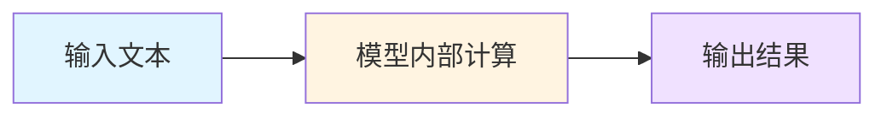
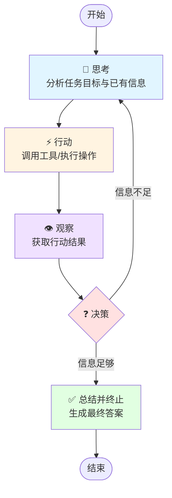

# AGENT实现复杂任务的通用逻辑「当前形态」-ReAct推理模式

## 一、为什么需要ReAct推理模式？

> 简单来说，CoT 是大脑，只负责思考逻辑分析；ReAct 是手和眼睛，负责操作和观察。

### :rocket: 溯源与跃升

#### 阶段一：生成式大语言模型阶段

预训练直觉阶段 (Pre-trained Intuition)，模型LLM主要是“概率预测下一个词”。你问它问题，它基于海量文本记忆给出最可能的答案



#### 阶段二：推理式大模型阶段 (CoT)

模型具备了复杂逻辑推理与问题解决能力，你不需要教它怎么思考，它会自动在后台生成几千字的推理逻辑，只给你最终准确的结果。

#### 阶段三：AI 智能体阶段 (ReAct Autonomy)

这是当前的形态，以推理式大模型为大脑，系统形成了完整的“感知 - 规划 - 记忆 - 执行 - 反思”自主决策与执行闭环 。AI 不再只是“给建议”，而是能够自主调用工具落地执行，完成从“工具”到“代理”的质变 。

### 原生模型问题：

- **无法主动调用外部工具**：大模型本身的知识截止到训练时间、不会联网、不会查向量库、不会算Token、不会做摘要压缩——而我们的业务任务，几乎都需要调用「向量知识库检索」「摘要工具」「计算器」这些外部能力；
- **极易产生幻觉+错误率高**：面对需要「严谨逻辑+外部事实」的任务，原生模型会瞎编答案，比如让它「查文档里的某个技术参数并计算」，它可能直接编一个参数值。

## 二、 ReAct 是什么？

**ReAct = Reason（推理/思考） + Act（行动/执行）**

- 人类解决复杂问题的思路：拿到问题 → 先思考「我该怎么做？分几步？」→ 第一步做什么（比如查资料）→ 看结果 → 第二步做什么（比如分析资料）→ 直到得出答案

- LLM的推理模式：拿到任务 → 按预设框架「思考下一步行动」→ 执行行动（调用工具/检索/计算）→ 观察行动结果 → 继续思考 → 直到完成任务

### :rocket: ReAct「标准四步循环」

ReAct 没有复杂的规则，就是一套**固定的循环逻辑**，所有复杂任务都能拆解到这个循环里，LLM严格按这个流程执行

> **思考 → 行动 → 观察 → 总结决策（是否结束或者循环）**

1. **思考 (Reason)**：模型分析当前的任务目标、已有的信息，判断「下一步我应该做什么？」「需要调用什么工具？」「需要获取什么信息？」
   - 比如：任务是「基于向量库回答问题」，思考的结果就是「我需要调用向量知识库，检索和用户问题语义相似的文档片段」；
   - 比如：任务是「回答长文档问题」，思考的结果就是「文档Token数超标，我需要先调用摘要工具压缩文档，再进行分析」。
2. **行动 (Act)**：执行思考阶段的决策，**调用外部工具/执行具体操作**（这是ReAct和其他推理模式的核心区别）。
   - 行动的类型：调用向量库检索、调用摘要函数压缩文本、调用计算器做运算、调用翻译工具、调用API接口、甚至是继续提问用户补全信息；
   - 关键点：行动是**具体的、可落地的**，不是空想，所有行动都有明确的结果。
3. **观察 (Observation)**：获取「行动」的结果，并反馈给模型。
   - 比如：调用向量库后，拿到了3条相似的文档片段；
   - 比如：调用摘要工具后，拿到了压缩后的200字核心文本；
   - 关键点：观察的结果是**客观事实**，能修正模型的思考，避免幻觉。
4. **总结/决策 (Terminate)**：模型根据「观察到的结果」，判断：
   - ✔️ 信息足够：整理所有信息，生成最终答案，任务结束；
   - ❌ 信息不足：重新进入「思考」环节，规划下一步行动（比如：检索的结果不够，需要扩大检索范围；摘要的信息不全，需要补充摘要）。



## 三、 ReAct进阶版-Plan&Execute「规划-执行」模式

> 核心定义是先「做整体规划」，再「分步执行」，最后「整合结果」。
> 如果说 ReAct 是"边走边看"的侦察兵，那么 Plan & Execute (规划 - 执行) 模式就是"谋定而后动"的指挥官。

### 为什么需要它？（对比 ReAct）

| 特性       | ReAct (边做边想)                     | Plan & Execute (先规划后执行)    |
| ---------- | ------------------------------------ | -------------------------------- |
| 任务复杂度 | 适合解决单一报错、修改单行代码       | 适合重构项目、从零搭建、迁移框架 |
| 稳定性     | 容易陷入局部循环（如反复试错镜像源） | 始终记得最终目标，不容易迷路     |
| 效率       | 步步为营，速度较慢                   | 可以并行处理互不依赖的子任务     |

### 假设你让 AI “修复 GitHub 部署失败并支持 Mermaid”

核心逻辑它将任务拆交给两个不同的角色（或两种思维状态）：Planner (规划者)和 Executor (执行者)。**对于每一项规划的执行再使用ReAct模式，两者相互配合**

#### **Step 1: Planning (规划)**

1. 检查本地 pnpm-lock.yaml 是否有错误的镜像源。
2. 修改本地配置并重新生成锁文件。
3. 安装 vite-plugin-mermaid 插件。
4. 修改 .vitepress/config.ts 启用静态渲染。
5. 更新 .github/workflows/deploy.yml 去掉不稳定的镜像配置。
6. 提交代码并观察 Actions 运行结果。

#### **Step 2: Execution (执行)**

1.  执行者开始做第 1 项，如果发现本地没装 pnpm，它会先解决环境问题，完成后划掉第 1 项，再看第 2 项。

#### **Step 3: Re-Planning (重规划)**

1. 如果第 4 步发现插件版本冲突，执行者会停下来，将当前控制权交给规划者，更新计划列表。

## 四、Demo示例

> Demo仅用于展示 ReAct 的循环骨架

<details>
<summary style=" cursor: pointer">查看代码</summary>

```python

"""
ReAct = Reason（推理/思考） + Act（行动/执行）
这是一个最简单的 ReAct推理模式实现示例
"""

import time
from typing import List, Dict, Any


class SimpleTool:
    """简单工具基类"""

    def __init__(self, name: str, description: str):
        self.name = name
        self.description = description

    def execute(self, **kwargs) -> Any:
        """执行工具并返回结果"""
        raise NotImplementedError


class CalculatorTool(SimpleTool):
    """计算器工具"""

    def __init__(self):
        super().__init__("calculator", "执行简单的数学计算")

    def execute(self, expression: str) -> str:
        """计算数学表达式"""
        try:
            # 安全的表达式计算
            result = eval(expression, {"__builtins__": {}}, {})
            return f"计算结果：{result}"
        except Exception as e:
            return f"计算错误：{str(e)}"


class SearchTool(SimpleTool):
    """搜索工具（模拟）"""

    def __init__(self):
        super().__init__("search", "搜索信息")

    def execute(self, query: str) -> str:
        """模拟搜索并返回结果"""
        # 模拟搜索结果
        mock_results = {
            "天气": "北京今天晴朗，温度 25°C",
            "人口": "中国人口约 14 亿",
            "首都": "中国的首都是北京"
        }
        for key, value in mock_results.items():
            if key in query:
                return f"搜索结果：{value}"
        return f"未找到相关信息：{query}"


class ReActAgent:
    """
    ReAct Agent 核心实现
    遵循：思考 → 行动 → 观察 → 总结 循环
    """

    def __init__(self, tools: List[SimpleTool]):
        self.tools = {tool.name: tool for tool in tools}
        self.thought_history = []

    def reason(self, task: str, observations: List[str]) -> str:
        """
        推理阶段：分析任务和已有信息，决定下一步行动
        这里用简单规则模拟 LLM 的推理过程
        """
        task_lower = task.lower()

        # 基于规则的简单推理（实际应用中由 LLM 完成）
        if any(word in task_lower for word in ["计算", "算", "math", "calculate"]):
            return "我需要调用计算器工具来完成计算"
        elif any(word in task_lower for word in ["搜索", "查找", "search", "find"]):
            return "我需要调用搜索工具来获取信息"
        elif observations:
            return "我已经收集到足够的信息，可以给出答案了"
        else:
            return "我需要先了解任务的具体需求"

    def act(self, thought: str, task: str) -> tuple:
        """
        行动阶段：执行推理阶段的决策
        返回：(工具名，工具执行结果)
        """
        # 根据思考内容选择工具（实际应用中由 LLM 解析）
        if "计算器" in thought or "计算" in thought:
            # 从任务中提取计算表达式
            expressions = [part for part in task.split() if any(c.isdigit() for c in part)]
            expression = " + ".join(expressions) if expressions else "10 + 20"
            return ("calculator", self.tools["calculator"].execute(expression=expression))
        elif "搜索" in thought or "搜索工具" in thought:
            return ("search", self.tools["search"].execute(query=task))
        else:
            return (None, None)

    def observe(self, action_result: tuple) -> str:
        """
        观察阶段：获取行动结果
        """
        tool_name, result = action_result
        if tool_name and result:
            return f"通过{tool_name}工具观察到：{result}"
        return "没有获得新的观察结果"

    def terminate(self, task: str, observations: List[str]) -> bool:
        """
        终止决策：判断是否可以结束任务
        """
        # 简单规则：如果有观察结果且任务似乎已完成
        # 实际由大模型判断
        if observations and len(observations) >= 1:
            # 检查是否包含最终答案的特征
            final_indicators = ["结果", "答案", "是", "了"]
            return any(indicator in "".join(observations) for indicator in final_indicators)
        return False

    def run(self, task: str, max_iterations: int = 5) -> str:
        """
        运行 ReAct 循环
        """
        print(f"\n{'='*60}")
        print(f"任务：{task}")
        print(f"{'='*60}")

        observations = []

        for i in range(max_iterations):
            print(f"\n--- 第 {i+1} 次循环 ---")

            # Step 1: 思考 (Reason)
            thought = self.reason(task, observations)
            print(f"🤔 思考：{thought}")
            self.thought_history.append(thought)
            time.sleep(0.5)

            # Step 2: 行动 (Act)
            action_result = self.act(thought, task)
            print(f"🔧 行动：调用 {action_result[0]} 工具")
            time.sleep(0.5)

            # Step 3: 观察 (Observation)
            observation = self.observe(action_result)
            print(f"👁️ 观察：{observation}")
            observations.append(observation)
            time.sleep(0.5)

            # Step 4: 总结/决策 (Terminate)
            if self.terminate(task, observations):
                print(f"✅ 任务完成！")
                break
            else:
                print(f"⏳ 继续下一轮循环...")

        # 生成最终答案
        final_answer = self.generate_final_answer(task, observations)
        print(f"\n{'='*60}")
        print(f"最终答案：{final_answer}")
        print(f"{'='*60}\n")

        return final_answer

    def generate_final_answer(self, task: str, observations: List[str]) -> str:
        """整合所有观察结果，生成最终答案"""
        if not observations:
            return "无法完成任务，没有获得有效信息"

        # 提取关键信息
        key_info = []
        for obs in observations:
            if "观察到：" in obs:
                content = obs.split("观察到：")[1]
                key_info.append(content)

        return f"基于任务'{task}'，我获得了以下信息：{'; '.join(key_info)}"


# ==================== 使用示例 ====================

if __name__ == "__main__":
    # 1. 初始化工具
    calculator = CalculatorTool()
    search = SearchTool()

    print(f"实列的属性{search.name},{calculator.description}")

    # 2. 创建 ReAct Agent
    agent = ReActAgent(tools=[calculator, search])

    # 3. 运行示例任务

    # 示例 1: 计算任务
    agent.run("计算 15 + 25 + 30 的结果")

    # # 示例 2: 搜索任务
    # agent.run("搜索北京的天气信息")

    # # 示例 3: 复杂任务（多轮循环）
    # agent.run("查找中国人口并计算如果每人分 100 元，总共需要多少钱")

```

</details>
示例用硬编码规则模拟了LLM 的思考推理和决策过程，在真实框架（LangChain、LlamaIndex）里，它们统一对应一个 LLM 调用，输入是拼好的 prompt，输出是带格式的文本，框架再解析出 Thought / Action / Action Input / Observation 各个字段。

## 五、总结

推理模式不是工具， 是Prompt设计+执行逻辑，所有大模型都能适配
