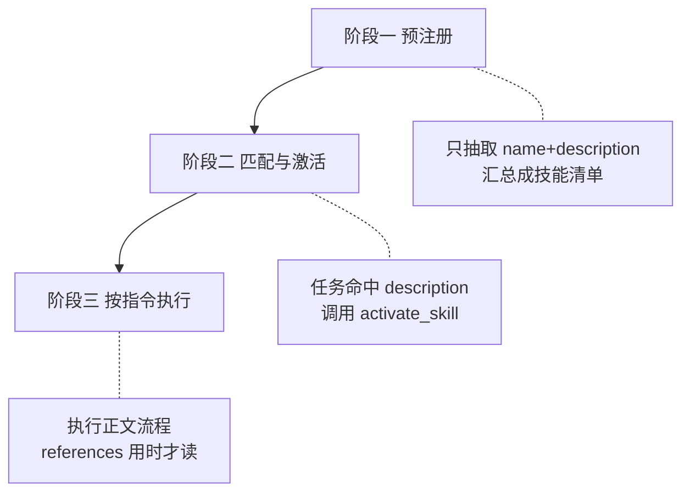
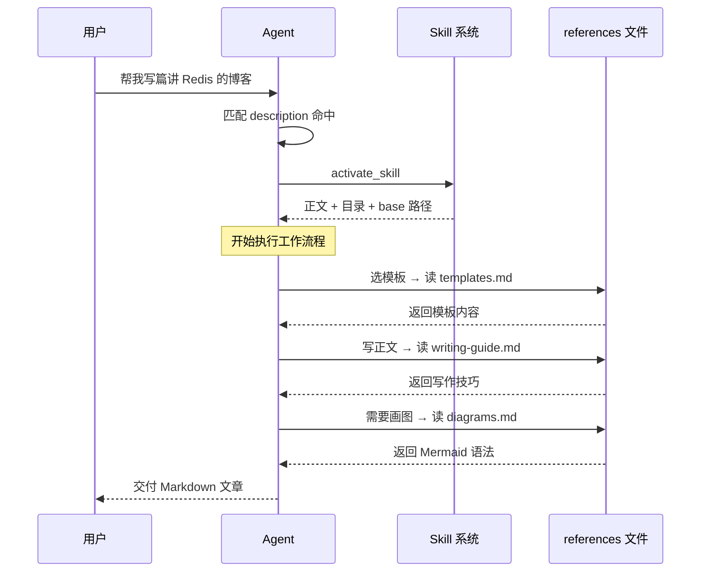

# Agent 的 Skill 是怎么被"想起来并用起来"的？

**一个 AI Agent 可能挂载了几十个 Skill**，但它不会把每个 Skill 的完整说明书都塞进上下文——那样既烧 token 又干扰判断。真正的做法是**三级渐进加载**：平时只记住每个 Skill 的"一句话简介 + 触发关键词"，任务命中了才把完整指令拉进来，指令里的细节文档（模板、示例）再等到用时才读。这篇文章拆解这套机制的每一步，并解释为什么要这么设计。

## 30 个 Skill，如何精准命中该用的那一个

假设你给 Agent 装了 30 个 Skill：写博客的、做代码审查的、生成埋点方案的……每个 Skill 的说明少则几百字，多则几千字。

那么问题来了：当你说"帮我写篇博客"时，Agent 是怎么在**不预先读完这 30 份说明书**的情况下，精准地挑出"写博客"那一个、并按它的规范干活的？

如果它把 30 份说明书全读进上下文,不仅浪费大量 token，还会让真正相关的指令淹没在噪音里。答案就是——**分阶段、按需加载**。下面用一个真实的博客写作 Skill（`tech-blog-writer`）为例，把整条链路走一遍。

## 整体机制

> **description 负责"被想起"，SKILL.md 正文负责"怎么做"，references 负责"细节按需取"。**

对应到时间线上就是三个阶段：



这三个阶段各自只加载"够用"的信息，一层比一层具体。我们逐个看。

## 阶段一：预注册——Agent 只是"知道有这么个技能"

对话还没开始时，系统会做一件准备工作：扫描技能目录（比如 `.joycode/skills/`），把每个 Skill 的 `SKILL.md` 打开，**但只抽取最顶部的元数据**——`name` 和 `description`，正文一概不读。

一个典型的 `SKILL.md` 头部长这样：

```yaml
---
name: tech-blog-writer
description: 生成软件开发技术博客文章。当用户要求根据代码生成一篇博客、
  写技术博客、源码解析、架构设计文章、原理剖析、踩坑总结、
  技术选型、教程/tutorial，或说"帮我写篇博客讲讲 X 技术"时使用……
metadata:
  short-description: 生成专业的软件开发技术博客
---

# 技术博客写作器
（下面是几千字的正文指令，此刻不加载）
```

这里有个容易混淆的点，值得单独讲清楚：

- **`description`（顶层）**：写满了触发关键词的长文本，作用是**被匹配**。系统靠它判断"用户这句话要不要用这个技能"。
- **`metadata.short-description`**：一行极简文字，作用是**给人看的展示标签**（技能列表里显示用），**不参与触发匹配**。

一句话记忆：`description` 给"匹配引擎"看，`short-description` 给"人"看。

抽完所有 Skill 的 name + description 后，系统把它们拼成一份"可用技能清单"注入系统提示。**此刻 Agent 手里只有一份目录**——它知道有哪些技能、各自大概能干嘛，但不知道每个技能具体怎么执行。

> 这一步的关键取舍：用极小的上下文成本（每个技能就一两行），换来"全局可发现性"。哪怕有 100 个技能，清单也不过百来行。

## 阶段二：匹配与激活——从"知道"到"拉进来"

现在你发话了："帮我写篇讲 Redis 的博客"。

Agent 做两件事：

1. **匹配**：拿你的这句话，去和清单里每个技能的 `description` 做语义比对。`tech-blog-writer` 的 description 里塞满了"写技术博客""帮我写篇博客讲讲 X 技术"这类关键词，命中。
2. **激活**：Agent 调用 `activate_skill(name="tech-blog-writer")`。

激活这个动作会返回三样东西——这是从"目录"升级到"完整说明书"的关键跳转：

| 返回内容 | 作用 |
|---|---|
| **SKILL.md 正文** | 完整的执行指令（工作流程、质量准则） |
| **目录结构** | 告诉 Agent 还有哪些 `references/` 文件可用 |
| **base 路径** | 后续按需读取细节文档的定位基准 |

注意：**激活只加载了正文，`references/` 里的细节文档仍然没读**。目录结构只是让 Agent "知道有这些文件"，就像阶段一里技能清单让它知道"有这些技能"一样——同一种"先给目录、用时再取"的思路，在不同层级重复了一次。

## 阶段三：按指令执行——references 用到才读

拿到正文后，Agent 把它当作**优先级高于自身通用默认的"专家级指令"**，严格照着里面的工作流程走。以 `tech-blog-writer` 为例，它的流程里明确写了哪一步该读哪个文件：



可以看到，`references/` 下的三个文件是**分时点、按需**读入的：

- 到"选模板"这步，才读 `templates.md`；
- 到"撰写正文"这步，才读 `writing-guide.md`；
- 只有当内容确实需要配图时，才读 `diagrams.md`。

如果这篇文章压根不需要画图，`diagrams.md` 就永远不会被加载——省下的就是实打实的上下文。

## 为什么要设计成三级？

行，但代价很大。我们把两种方案对比一下：

| 维度 | 一次性全加载 | 三级渐进加载 |
|---|---|---|
| 上下文占用 | 所有技能正文+细节全进上下文，极度膨胀 | 平时仅几十行清单，用到才展开 |
| 匹配准确度 | 大量无关指令形成噪音，干扰判断 | 只有命中的技能指令进入视野 |
| 扩展性 | 技能越多越卡，有上限 | 加技能几乎零边际成本 |
| 成本 | 每轮对话都为用不到的技能付费 | 只为真正用到的部分付费 |

**核心取舍**：渐进加载用"多几次读取调用"换"上下文的精简与聚焦"。对 Agent 来说，上下文是最稀缺的资源，这笔账几乎总是划算的。

## 用图书馆类比

> 这就像你走进一家大图书馆。**阶段一**你先看**索引卡片**（每本书只有书名+简介，对应 name+description）；**阶段二**你根据需求**抽出那一本书**（借出正文，对应 activate_skill）；**阶段三**你读到某章需要附录时，**才翻到附录那几页**（对应按需读 references）。

类比会在哪失效？图书馆的书是静态的，而 Skill 的 `references` 是按 SKILL.md 正文里的指令**主动**去取的——更像"按菜谱步骤，做到哪一步才拿哪样食材"。

## 小结

- **三级渐进加载**：description（被想起）→ SKILL.md 正文（怎么做）→ references（细节按需取）。
- **两个 description 别搞混**：顶层 `description` 管触发匹配，`metadata.short-description` 只是展示标签。
- **激活 ≠ 全部读入**：`activate_skill` 只返回正文 + 目录 + base 路径，细节文档仍要用时才读。
- **设计动机是省上下文**：用少量额外读取调用，换取上下文的精简、匹配的准确和近乎无限的扩展性。
- **降级兜底**：若激活失败或找不到技能，Agent 会退回通用方式处理，不会卡死。

如果你要自己写一个 Skill，最该打磨的就是那段 `description`——它决定了你的技能"能不能在对的时刻被想起来"。