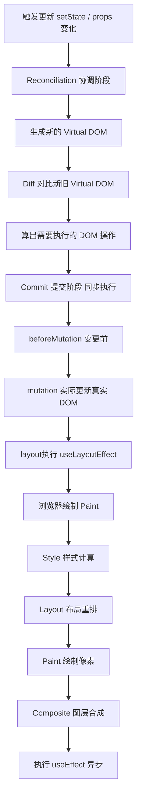
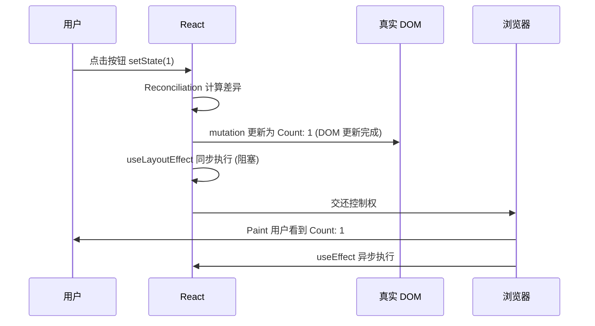

# DOM 已经改了，为什么屏幕还没变？React 更新时机全解析

你有没有遇到过这种诡异的现象：页面加载时元素先闪了一下（比如高度先是 0，紧接着"跳"到真实值），或者你在某个副作用里读 `offsetWidth` 拿到的是旧值。这些问题的根源，几乎都指向同一个被忽略的细节——**"DOM 更新完成"和"用户看到变化"并不是同一个时刻**。

这篇文章想把这个中间地带讲清楚：React 在什么时候真正改了真实 DOM、浏览器又是什么时候把它画到屏幕上，以及 `useLayoutEffect` 和 `useEffect` 各自卡在这条时间线的哪个位置。搞懂它，你就能自己判断"这个 effect 该用哪个"，而不是靠试。

## 一句话先建立坐标

**"DOM 更新完成"指的是：React 已经把新旧虚拟 DOM 的差异应用到了真实 DOM 树上，节点的增删改已经发生，但浏览器还没有把这些变化绘制（Paint）到屏幕上。**

换句话说，这是一个**你能读到、能改，但用户还看不到**的时间窗口。理解这一点，后面所有的时机问题都会变得顺理成章。

## React 一次更新到底经历了什么

从你调用 `setState` 到用户眼睛看到新画面，中间是一条相当长的流水线。先看全貌，再逐段拆。



这条链路可以分成两大块理解：

- **Render 阶段（Reconciliation）**：纯计算，不碰真实 DOM。React 在内存里构建新的 Fiber 树，用 Diff 算法算出"哪些节点要变"。这个阶段可以被打断、可以重来，所以不能有副作用。
- **Commit 阶段**：同步、不可打断。React 把上一步算出的变更一口气应用到真实 DOM。**我们说的"DOM 更新完成"，就发生在这个阶段内部的 mutation 子阶段。**

关键在于：Commit 结束 ≠ 用户看到。浏览器的绘制（Paint）是在 Commit 之后、由浏览器接管的另一件事。中间那道缝，就是本文的主角。

## Commit 阶段内部的三个子阶段

Commit 阶段并不是"啪"一下就完事，它内部按顺序分成三步。用一段简化的 React 内部逻辑来看最直观：

```typescript
// React 内部逻辑（高度简化，仅示意执行顺序）
function commitRoot() {
  // 1. beforeMutation：读取变更前的状态（如 getSnapshotBeforeUpdate）
  commitBeforeMutationEffects()

  // 2. mutation：真正把变更写进真实 DOM ⭐ 这一行执行完，"DOM 更新完成"
  commitMutationEffects()
  // 此刻：DOM 节点已经是新的了，但屏幕上还是旧画面
  // 你可以安全地读 ref.current、读尺寸、改属性

  // 3. layout：同步执行布局副作用（useLayoutEffect / componentDidMount）
  commitLayoutEffects()

 // 4. 调度被动副作用：useEffect 不在这里跑，而是被排到绘制之后异步执行
  scheduleCallback(NormalPriority, () => {
    commitPassiveEffects() // useEffect 在这里
  })
}
```

三步的分工是这样的：

- **mutation**：执行 `commitMutationEffects()` 这一行的瞬间，真实 DOM 就变了。这是"DOM 更新完成"的精确时刻。
- **layout**：紧接着**同步**执行所有 `useLayoutEffect` 的回调。因为是同步的，它会**阻塞浏览器绘制**——浏览器必须等这一步跑完才能 Paint。
- **passive**：`useEffect` 的回调被丢进调度器，等浏览器绘制完之后**异步**执行，不阻塞画面。

所以在 mutation 之后、Paint 之前，你已经拥有了一个"最新的 DOM"，只是它还没上屏。这正是 `useLayoutEffect` 存在的理由。

在这个窗口里，下面这些操作都是安全的：

```typescript
useLayoutEffect(() => {
  const el = divRef.current!
  // ✅ 节点已是最新的，可以放心读
  const width = el.offsetWidth
  const rect = el.getBoundingClientRect()
  // ✅ 也可以再改，改动会被合并进即将到来的这一次 Paint
  el.style.color = 'red'
})
```

## useLayoutEffect 和 useEffect 差在哪一帧

这是整篇文章最实用的部分。两个 Hook 的 API 长得几乎一样，差别只在**执行时机**——一个在 Paint 之前（同步），一个在 Paint 之后（异步）。

看一个能同时触发两者的例子：

```typescript
import { useState, useEffect, useLayoutEffect, useRef } from 'react'

function Example() {
  const [count, setCount] = useState(0)
  const divRef = useRef<HTMLDivElement>(null)

  // 1️⃣ DOM 更新后、浏览器绘制前（同步，会阻塞 Paint）
  useLayoutEffect(() => {
    console.log('layout:', divRef.current?.offsetWidth) // 读到的是最新尺寸
    if (divRef.current) divRef.current.style.color = 'red'
  }, [count])

  // 2️⃣ 浏览器绘制后（异步，不阻塞 Paint）
  useEffect(() => {
    console.log('passive:', divRef.current?.offsetWidth)
    if (divRef.current) divRef.current.style.backgroundColor = 'blue'
  }, [count])

  return (
    <div ref={divRef}>
      <p>Count: {count}</p>
      <button onClick={() => setCount(c => c + 1)}>增加</button>
    </div>
  )
}
```

点一次按钮，这条时间线依次发生：



注意两个 effect 里都改了样式，但影响完全不同：

- `useLayoutEffect` 改的 `color`，因为在 Paint 之前，会被**合并进同一次绘制**，用户直接看到红色，没有闪烁。
- `useEffect` 改的 `backgroundColor`，发生在 Paint 之后，会**额外触发一次重排 + 重绘**，如果改动影响视觉，用户可能看到"先旧后新"的闪动。

## 一个会闪烁的真实 bug

理论讲完，来看它怎么坑人。需求很常见：渲染后测量容器实际高度，再用这个高度做点事（比如做展开动画）。

先看**错误写法**——用 `useEffect` 测量：

```typescript
function AutoHeight() {
  const [height, setHeight] = useState(0)
  const ref = useRef<HTMLDivElement>(null)

  // ❌ useEffect 在 Paint 之后才跑
  useEffect(() => {
    if (ref.current) setHeight(ref.current.scrollHeight)
  }, [])

  return <div ref={ref} style={{ height }}>内容…</div>
}
```

它的执行链是这样的，问题就藏在里面：

```
首次渲染 height=0 → DOM 更新 → Paint（用户看到 height=0，塌陷）
→ useEffect 执行 → setHeight(真实值) → 二次渲染 → 再 Paint（跳到真实高度）
```

用户先看到高度 0，再看到真实高度——**闪烁**就来自这两次 Paint 之间的落差。

改成 `useLayoutEffect` 就干净了：

```typescript
function AutoHeight() {
  const [height, setHeight] = useState(0)
  const ref = useRef<HTMLDivElement>(null)

  // ✅ useLayoutEffect 在 Paint 之前跑
  useLayoutEffect(() => {
    if (ref.current) setHeight(ref.current.scrollHeight)
  }, [])

  return <div ref={ref} style={{ height }}>内容…</div>
}
```

因为它发生在 Paint 之前，`setHeight` 触发的重渲染会**在浏览器绘制那一帧之前完成并合并**，用户第一次看到的就已经是正确高度，中间那次"height=0"的画面根本没机会上屏。

**判断口诀：凡是"读了 DOM 布局信息、又立刻要根据它改 DOM/样式，且这个改动会被用户看见"的场景，用 `useLayoutEffect`；其余绝大多数副作用（请求数据、订阅、打日志、setTimeout）都该用 `useEffect`。**

## "DOM 更新完成"不等于"用户看得见"

再强调一个容易混淆的点：DOM 里存在某个节点，和用户能看到它，是两码事。

```typescript
function VisibilityExample() {
  const [visible, setVisible] = useState(false)
  const ref = useRef<HTMLDivElement>(null)

  useEffect(() => {
    // DOM 已更新：节点确实存在DOM 树里了
    console.log('节点存在吗？', !!ref.current)
    // 但"能不能看见"还取决于 CSS：display:none、opacity:0、
    // 在视口外、被遮挡……都可能让它"存在但不可见"
  }, [visible])

  return (
    <div ref={ref} style={{ display: visible ? 'block' : 'none' }}>
      内容
    </div>
  )
}
```

"DOM 更新完成"只保证**结构层面**的操作已落地——你能通过 `ref` 拿到节点、能读它的属性。至于它是否呈现在用户眼前，那是 CSS 和浏览器绘制共同决定的另一件事。

## 对齐浏览器的渲染管线

把 React 的时机放到浏览器渲染管线上，一切就对上了：

```
JavaScript 执行（含 React Commit）
      ↓
Style 样式计算
      ↓
Layout 布局／重排        ← useLayoutEffect 在这一步之前同步执行
      ↓
Paint 绘制像素           ← 用户此刻才看到变化
      ↓
Composite 图层合成       ← useEffect 在这之后异步执行
```

- **DOM 更新完成**：在 Layout 之前（Commit 的 mutation 子阶段）。
- **useLayoutEffect**：在 Layout 之前同步跑，能赶在绘制前做最后调整，代价是阻塞绘制——所以别在里面放重活。
- **Paint**：用户看到变化的那一刻。
- **useEffect**：Paint 之后异步跑，不阻塞画面，适合放耗时或不影响首帧的逻辑。

## 小结

- **"DOM 更新完成"是一个中间状态**：React 已改真实 DOM（Commit 的 mutation 子阶段），但浏览器还没 Paint，用户还看不到。
- **Commit 分三步**：mutation（改 DOM）→ layout（同步跑 useLayoutEffect）→ passive（异步跑 useEffect）。
- **useLayoutEffect 在 Paint 前、同步、阻塞绘制**；**useEffect 在 Paint 后、异步、不阻塞**。
- **要读布局并立刻改、且改动会被看见 → useLayoutEffect**，可避免闪烁；否则一律优先 `useEffect`，别让副作用白白拖慢首帧。
- **节点存在 ≠ 用户可见**：可见性由 CSS 和绘制决定，不由"DOM 是否更新完成"决定。

一个能带走的心法：当你纠结"这个 effect 该用哪个 Hook"时，问自己一句——"这段逻辑跑之前，用户是不是不能先看到当前画面？" 如果是，用 `useLayoutEffect`；如果无所谓，用 `useEffect`。

## 延伸阅读

- React 官方文档：[useLayoutEffect](https://react.dev/reference/react/useLayoutEffect)、[useEffect](https://react.dev/reference/react/useEffect)
- [A (Complete) Guide to useEffect — Dan Abramov](https://overreacted.io/a-complete-guide-to-useeffect/)
- 浏览器渲染管线：[Render-tree Construction, Layout, and Paint — web.dev](https://web.dev/articles/critical-rendering-path/render-tree-construction)