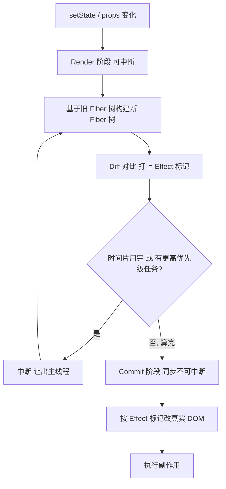

# 为什么它只算不改，还能中途反悔？React 的 Render 阶段

在上一篇《DOM 已经改了，为什么屏幕还没变？》里，我们把一次更新拆成了 Render 和 Commit 两大块，并顺带提了一句：**Render 阶段是纯计算，不碰真实 DOM，可以被打断、可以重来，所以不能有副作用。**

这句话信息量其实很大，但当时一笔带过了。这篇就专门把它讲透：为什么 Render 阶段"只算不改"？"可中断、可重来"到底是怎么做到的？以及——为什么正因为它能重来，你就绝对不能在里面写副作用。

## 先记住这条分界线

**Render 阶段做的事情只有一件：在内存里算出"下一版 UI 应该长什么样"，并标记出哪些地方要变。它不改任何真实 DOM，算错了、被打断了，大不了从头再算一遍。真正动手改 DOM，是后面 Commit 阶段的事。**

把它类比成写文章：Render 阶段是在草稿纸上打草稿、反复涂改，Commit 阶段才是把定稿誊写到正式的纸上。草稿可以撕了重写，誊写却是一次性的、不能反悔。

## 一次更新的两个阶段

先把整条链路摆出来，标清楚 Render 阶段的边界：



注意那个回环：Render 阶段可以被打断，让出主线程，之后**从中断处继续甚至从头重来**。而一旦进入 Commit，就是一条道走到黑，同步执行、不可中断。这条分界线，是理解一切的钥匙。

## 为什么 Render 阶段必须"只算不改"

老 React（15 及以前）的协调是**递归、同步、不可中断**的：一旦开始 diff，就必须一口气递归完整棵组件树。组件树一大，这个过程可能占用主线程几十甚至上百毫秒，期间浏览器无法响应任何输入——表现出来就是**点击没反应、动画卡顿、输入框打字延迟**。

React 16 想解决这个问题，思路是把这个大计算**切成小块，穿插着执行**，中间给浏览器留出响应用户的空隙。但"能中途暂停再继续"有个硬性前提：

> 暂停时不能留下"半成品"的副作用。

假设 Render 阶段允许直接操作真实 DOM，那么当一个更新算到一半被打断，真实 DOM 就处于一个"改了一半"的中间态——用户可能看到残缺画面，更糟的是这次更新还可能因优先级被丢弃、重算。改到一半的 DOM 根本没法干净地回滚。

所以 React 的设计是：**Render 阶段的所有产出都停留在内存里的 Fiber 结构上，不落地到真实 DOM。** 这样无论被打断多少次、重算多少次，真实世界都毫发无损，直到 Commit 阶段一次性、原子地应用。

## Fiber：让计算可以"存档读档"的数据结构

要支持"算一半停下来、之后接着算"，你需要能把计算的中间状态**存下来**。递归调用栈做不到这点——函数一旦被打断，调用栈信息就丢了。

React 的解法是 **Fiber**：把原来递归的组件树，改造成一棵由 Fiber 节点组成的链表树。每个 Fiber 节点大致对应一个组件/DOM 节点，保存着这个节点的类型、props、state，以及三个关键指针：

```js
// Fiber 节点结构（大幅简化）
const fiber = {
  type: 'div',          // 组件类型或 DOM 标签
  stateNode: null,      // 对应的真实 DOM / 组件实例
  child: null,          // 指向第一个子节点
  sibling: null,        // 指向下一个兄弟节点
  return: null,         // 指向父节点
  alternate: null,      // 指向上一次渲染的对应 Fiber（双缓存）
  flags: 0,             // Effect 标记：这个节点要 增/删/改?
}
```

有了 `child` / `sibling` / `return` 三个指针，遍历整棵树就不再依赖递归调用栈，而是变成**可以手动控制的循环**。React 用一个 `workInProgress` 指针记录"现在算到哪个节点了"，每处理完一个节点就移动指针：

```js
// 工作循环（简化）：可以在任意一次循环之间暂停
function workLoopConcurrent() {
  while (workInProgress !== null && !shouldYield()) {
    workInProgress = performUnitOfWork(workInProgress) // 处理一个 Fiber
  }
  // shouldYield() 为 true 时跳出循环，让出主线程；
  // 下次调度进来，从 workInProgress 记录的位置继续
}
```

**这就是"可中断、可重来"的底层实现**：进度存在 `workInProgress` 指针上，随时能停、随时能接着跑。至于 `shouldYield()` 怎么判断"该让出了"、让出后靠什么机制再被唤醒——那是调度器（Scheduler）的活儿，查看《useEffect 的"异步"到底靠什么？拆解 React 调度器》，这里只需知道工作循环给了它中断的能力。

## 双缓存：算的是新树，屏幕上还是旧树

Fiber 里那个 `alternate` 指针指向"上一次渲染的对应节点"，这引出 React 的**双缓存（double buffering）**机制。

React 同时维护两棵 Fiber 树：

- **current 树**：当前屏幕上正在显示的那一版，对应真实 DOM。
- **workInProgress 树**：Render 阶段正在内存里构建的新版。

Render 阶段所有的计算，都作用在 workInProgress 树上，current 树纹丝不动。这就是为什么算到一半被打断也没关系——用户看到的始终是完整的 current 树。等 workInProgress 树彻底算完并通过 Commit 落地后，React 只需把 `current` 指针**一次性切到新树**，完成"换帧"。

这和图形渲染里的双缓冲是同一个道理：一块缓冲区正在显示，另一块在后台画，画好了再交换，避免用户看到"正在绘制"的中间过程。

## Diff：算出"到底哪里变了"

### 先厘清一件事：被 Diff 的两边，其实不是同一种东西

讲 Diff 之前，先把一个常见误区拎出来：**JSX 编译后的产物不是 Fiber，而是 React Element（也就是通常说的"虚拟 DOM"）。** 从写下的 JSX 到最终参与 Diff，中间隔着三段路：

```text
JSX
  │  Babel / SWC 编译
  ▼
React.createElement(...) / _jsx(...)  ← 只是函数调用
  │  函数执行
  ▼
React Element（虚拟 DOM）             ← 只读的普通 JS 对象，用完即弃
  │  Render 阶段协调
  ▼
Fiber 节点                            ← 可变、长期存在的工作单元
```

React Element 长这样，是一份**只读的"设计图"**：

```js
// <div className="box">hello</div> 编译执行后得到的 Element
{
  $$typeof: Symbol(react.element),
  type: 'div',
  key: null,
  ref: null,
  props: { className: 'box', children: 'hello' },
}
```

而 Fiber 是前面那个带 `child` / `sibling` / `return` / `alternate` / `flags` 的**可变"施工单"**。两者的分工可以并排看：

| 维度 | React Element（虚拟 DOM） | Fiber 节点 |
| --- | --- | --- |
| 角色 | 描述"要渲染什么" | 描述"怎么渲染、要干哪些活" |
| 生命周期 | 每次渲染重建，用完即弃 | 跨渲染复用，靠 `alternate` 关联新旧两版 |
| 是否可变 | 不可变 | 可变（打 flags、记录 state、hooks 链等） |
| 调度信息 | 无 | 有（优先级、Effect 标记等） |

**Diff 真正做的事，是拿新一轮渲染产出的 Element，去和上一版 current Fiber 树对比，产出打了标记的 workInProgress Fiber 树。** 不是"新 Element 和旧 Element 比"，也不是"新 Fiber 和旧 Fiber 比"——搞清楚这个方向，后面三条规则才好对上号。

### 三条启发式规则

构建 workInProgress 树的过程中，React 要对比新旧节点，决定每个节点是复用、更新、新建还是删除——这就是 **Diff（协调）**。完整的树对比理论复杂度是 O(n³)，不可接受，React 靠三条启发式规则把它压到 O(n)：

1. **不同类型的节点，直接换掉整棵子树**。`<div>` 变成 `<span>`，React 不会试图复用，而是删掉旧的、建新的——因为跨类型复用的收益极低。
2. **同层比较，不跨层移动**。React 只在同一层级横向对比，不会把一个节点从这一层"挪"到另一层。
3. **用 key 识别列表项**。列表里靠 `key` 判断哪些是同一个元素，从而稳定地复用、而不是按位置错配。

Diff 的产出不是立刻改 DOM，而是给每个需要变动的 Fiber 打上 **Effect 标记**（就是前面 `flags` 字段）：这个要新增（Placement）、那个要更新（Update）、另一个要删除（Deletion）。

```js
// Diff 的产出：给 Fiber 打标记，而不是直接操作 DOM
newFiber.flags |= Placement  // 标记：Commit 时要插入这个节点
oldFiber.flags |= Deletion   // 标记：Commit 时要删除这个节点
```

这些标记会串成一条"该干哪些活"的清单，交给 Commit 阶段照单执行。**Render 阶段只是列购物清单，Commit 阶段才去结账付款。**

## 为什么绝对不能在 Render 阶段写副作用

现在可以回答开头那个"所以"了。Render 阶段的函数组件体、`useMemo` 的计算函数、类组件的 `render` 方法——这些代码可能因为中断而**被执行多次**，也可能算了一半的结果**被直接丢弃**。

如果你在里面写了副作用，后果很直接：

```jsx
function BadComponent() {
  // ❌ 灾难写法：副作用直接写在 Render 阶段
  logToServer('组件渲染了')          // 可能被上报好几次
  window.count++                     // 计数会因重算而错乱
  document.title = 'Loading...'      // 直接改了外部世界，没法回滚

  return <div>...</div>
}
```

`logToServer` 可能因为重算被调用多次导致数据翻倍；`window.count++` 的结果不可预测；`document.title` 这类对外部世界的修改，一旦这次 Render 被丢弃就再也收不回来了。

正确的做法是把副作用放进 `useEffect` / `useLayoutEffect`——它们在 Commit 阶段之后执行，而 Commit 阶段是**保证只执行一次、不可中断**的。这也正是上一篇讲的那条时间线的意义所在：副作用必须等到"计算已成定局"才动手。

```jsx
function GoodComponent() {
  // ✅ 副作用交给 effect，在 Commit 之后、确定要生效时才执行
  useEffect(() => {
    logToServer('组件渲染了')
    document.title = 'Loading...'
  }, [])

  return <div>...</div>
}
```

## 小结

- **Render 阶段只算不改**：所有产出停留在内存里的 Fiber 树上，不碰真实 DOM；改 DOM 是 Commit 阶段的事。
- **可中断、可重来**：靠 Fiber 链表结构 + `workInProgress` 指针把进度存下来，工作循环可以随时暂停、让出主线程、之后接着跑，从而不阻塞用户交互。
- **双缓存保证安全**：计算发生在 workInProgress 树，屏幕上始终是完整的 current 树，算完才一次性切换。
- **Diff 只打标记不动手**：拿新的 React Element（虚拟 DOM）和旧的 current Fiber 树对比，用"类型 / 同层 / key"三条启发式规则把复杂度压到 O(n)，产出是打了 Effect 标记的 workInProgress Fiber 树，交给 Commit 执行。
- **副作用为什么不能写在这里**：因为这里的代码可能被重复执行或整体丢弃，任何对外部世界的修改都无法安全回滚——所以副作用要放进 effect，等 Commit 之后再跑。

一句能带走的话：**Render 阶段是一张随时能撕掉重写的草稿，正因为它可以反悔，你就绝不能在草稿里做"泼出去的水"式的操作。**

## 延伸阅读

- 上一篇：《DOM 已经改了，为什么屏幕还没变？React 更新时机全解析》
- React 官方文档：[Render and Commit](https://react.dev/learn/render-and-commit)
- [React as a UI Runtime — Dan Abramov](https://overreacted.io/react-as-a-ui-runtime/)