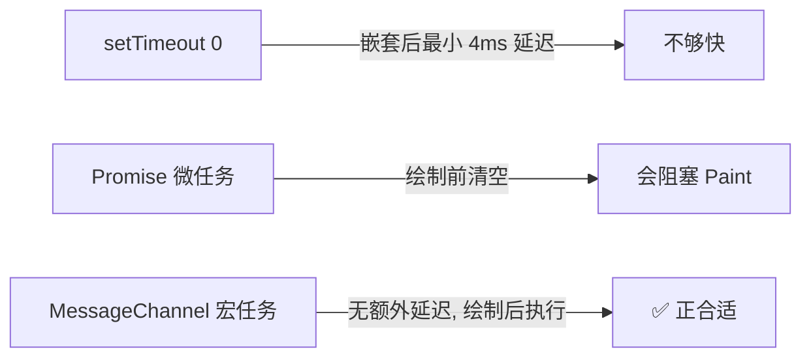
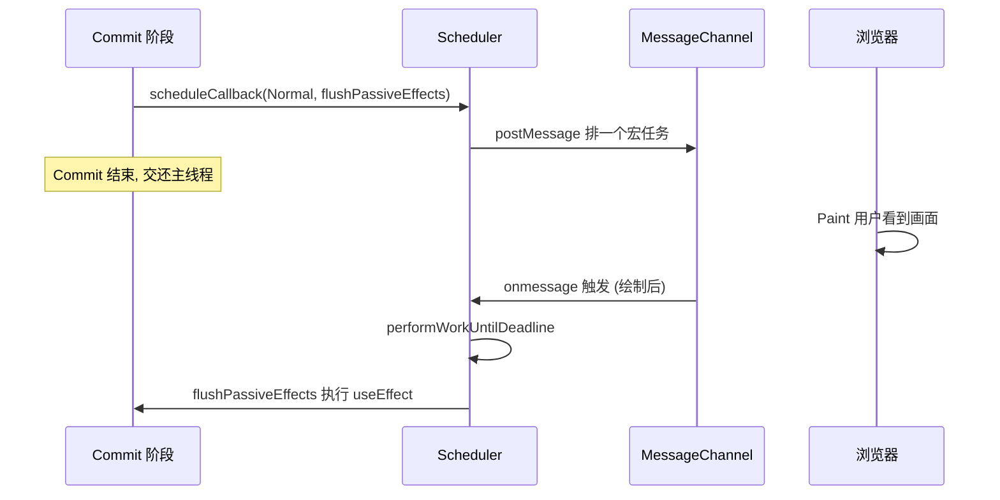
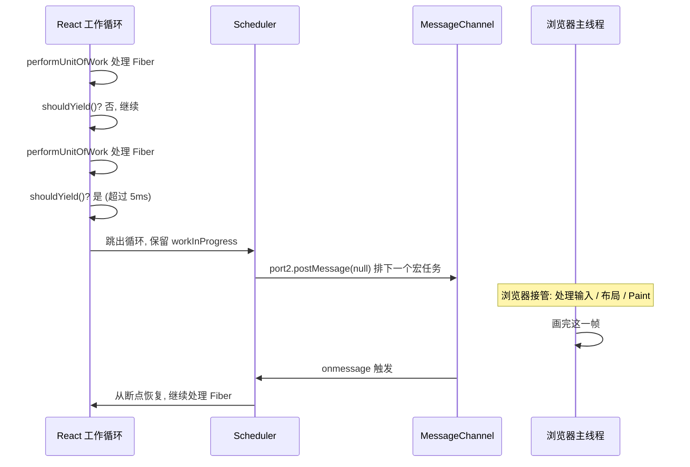

# useEffect 的"异步"到底靠什么？拆解 React 调度器

前面两篇我们知道了两件事：`useEffect` 在浏览器绘制（Paint）之后才执行，而 Render 阶段之所以能"中途暂停、之后接着算"，靠的是工作循环里那句 `shouldYield()`。这两件事背后其实是同一个模块在支撑——**Scheduler，React 的调度器**。

这篇就把它拆开：`useEffect` 说的"异步"到底是怎么实现的？它是 `setTimeout` 吗？"让出主线程再继续"又是靠什么？读完你会发现，答案既不玄乎，也不是你以为的那个 API。

## 一句话说清它在干什么

**调度器做的事只有一件：决定"什么任务、在什么时候、执行多久"，让浏览器能先响应用户和绘制画面，再在空隙里不阻塞地干 React 自己的活。** 它不是靠 `setTimeout` 或 `Promise`，而是自成一套基于宏任务 + 时间切片 + 优先级的调度系统。

## 为什么需要一个调度器

回到 `useEffect` 的执行时机。Commit 阶段结束后，理想的顺序是：

```js
commitMutation()      // 1. 更新真实 DOM
commitLayoutEffects()
scheduleCallback() // 2. 调度被动副作用
browserPaint()        // 3. 浏览器绘制，用户看到画面
runPassiveEffects()   // 4. 执行副作用 useEffect 
```

如果第 3 步紧跟第 1 步**同步执行**，那它就变成 `useLayoutEffect` 了——会阻塞绘制，用户迟迟看不到画面。所以 React 需要一种机制：**先让浏览器把画面画出来，之后有空了再回来执行 useEffect。**

"之后有空了再执行"——这就是调度器要解决的核心问题。而它要解决的不止 `useEffect`，还有 Render 阶段那个"算一半让出去、之后再接着算"的需求。本质是同一件事：**把一段本可以一口气跑完的 JS，拆开、延后、穿插进浏览器的空隙里。**

## 它不是 setTimeout，而是 MessageChannel

很多人以为 `useEffect` 的异步是 `setTimeout(fn, 0)` 或 `Promise.resolve().then()` 实现的。都不是。React 的 scheduler 首选 **MessageChannel**：

```js
// scheduler 内部的降级策略（简化）
if (typeof MessageChannel !== 'undefined') {
  // ✅ 首选：MessageChannel（宏任务，但没有 setTimeout 的最小延迟）
  const channel = new MessageChannel()
  port = channel.port2
  channel.port1.onmessage = performWorkUntilDeadline
} else {
  // 降级：环境不支持时才退回 setTimeout
  schedulePerformWorkUntilDeadline = () => setTimeout(performWorkUntilDeadline, 0)
}
```

为什么不用 `setTimeout(fn, 0)`？因为它有个坑：**嵌套调用超过 5 层后，浏览器会强制施加最小 4ms 的延迟**。React 需要频繁地"让出再回来"，每次都被拖 4ms，累积起来就是明显的卡顿。

而 `MessageChannel.postMessage` 触发的 `onmessage` 也是宏任务，但**没有这个最小延迟**，能在浏览器绘制完的第一时间被调回来执行。

### 为什么它能"绘制完第一时间被调回"

要说清这一点，得先看浏览器**一帧里的事件循环顺序**：

```text
执行一个宏任务(macrotask)
   ↓
清空所有微任务(microtask queue)      ← Promise.then 在这里
   ↓
执行 requestAnimationFrame 回调
   ↓
样式计算 → 布局 Layout → 绘制 Paint  ← 屏幕真正更新
   ↓
(如果有空闲)执行 requestIdleCallback
   ↓
进入下一轮：取下一个宏任务
```

关键在于：**微任务在"当前宏任务末尾、Paint 之前"就被清空；而下一个宏任务要等到"Paint 之后"才轮到。** 三种方案落在这个循环里的位置也就分出了高下：

| 方案 | 落在循环哪个位置 | 结果 |
|------|-----------------|------|
| `Promise.then`(微任务) | 当前宏任务尾部，**Paint 前** | 抢在绘制前跑，阻塞 Paint |
| `setTimeout(fn, 0)`(宏任务) | 下一个宏任务，Paint 后 | 位置对，但嵌套 >5 层被强制加 4ms |
| `MessageChannel`(宏任务) | 下一个宏任务，Paint 后 | 位置对，且**无最小延迟** |

`port.postMessage()` 会往**宏任务队列**投递一条消息，触发 `port1.onmessage`。它有两个决定性特点：

1. **它是宏任务**，所以排在本轮 Paint **之后**——满足"绘制后再执行 useEffect"的诉求，不阻塞绘制；
2. **它没有 `setTimeout` 的 clamping(钳制)**。规范规定 `setTimeout` 嵌套超过 5 层要强制拉到最小 4ms，而消息投递没有这个约束，浏览器处理完渲染、进入下一轮事件循环时会**立刻**取出这个任务执行。

所以"绘制完第一时间被调回" = **绘制结束、事件循环进入下一轮的那一刻，这个宏任务就被立即执行，中间不额外空等 4ms。** 这让 React 能高频地"让出主线程 → 绘制 → 立刻抢回来接着算"，把长任务切片穿插进帧与帧的空隙里，既不掉帧也不空等。

> 一个精确的细节：严格说 `postMessage` 的回调并不**保证**一定在 Paint 之后——如果本轮还没到渲染时机(一帧未满 16.6ms)，它可能在下一个宏任务里先跑、此时还没绘制。更准确的表述是：**它是"无额外延迟的宏任务"，绝不会像微任务那样在 Paint 前的当前轮被清空，因此天然适合承载"绘制后再执行"的任务。**

那为什么不用微任务（`Promise.then`）？因为微任务会在**当前这一轮**任务的末尾、绘制**之前**清空——用它的话 `useEffect` 又会赶在 Paint 前跑，退化成阻塞绘制。React 要的恰恰是"绘制之后"，所以必须用宏任务。



## scheduleCallback 只是"登记"，不是"执行"

理解调度器最关键的一点：Commit 阶段里那句调度 `useEffect` 的代码，**只是把任务登记进队列，并不当场执行**。

```js
// react-reconciler 内部（简化）
function commitRootImpl() {
  // ... 处理完 mutation、layout 阶段

  if (rootDoesHavePassiveEffects) {
    // 只是"登记"：告诉调度器有个 Normal 优先级的活要干
    scheduleCallback(NormalPriority, () => {
      flushPassiveEffects()   // 真正执行所有 useEffect 的回调
      return null
    })
    // 注意：代码走到这里就返回了，flushPassiveEffects 此刻还没跑
  }
}
```

`scheduleCallback` 做的是：把这个回调连同它的优先级，放进调度器内部的任务队列（一个按到期时间排序的小顶堆），然后通过前面的 `MessageChannel` 排一个宏任务。真正的执行，要等浏览器绘制完、宏任务被调起时才发生：



**"登记"与"执行"分离，正是异步的本质**：登记是同步的、瞬间完成的；执行被推迟到了浏览器绘制之后的宏任务里。

## 时间切片：干 5ms 就"让一让"

调度器不只是"延后执行"，它还要防止**一次干太久把主线程卡死**。假如 `useEffect` 里有几百个回调、或者 Render 阶段要处理上万个 Fiber，一口气跑完照样会让页面失去响应。

解法是**时间切片（Time Slicing）**：给每一批任务发一个约 5ms 的"许可时间"，到点就主动停下来把控制权还给浏览器。

### 为什么必须"干一小段就停"

浏览器主线程是**单线程的**：JS 执行、样式计算、布局、绘制、用户输入响应，全都排队走这一条线。

- 如果 React 一口气把成千上万个 Fiber 都处理完，主线程会被独占几十甚至上百毫秒。
- 这期间用户点击、输入、滚动，浏览器都来不及响应，页面就"卡住"了。
- 更糟糕的是，浏览器每 16.6ms 需要出一帧画面，主线程被占着不放，就会**掉帧**。

所以调度器的策略不是"能干多少干多少"，而是**"干一小段，主动让出，等下一次机会再接着干"**——这一小段大约就是 5ms。

### "一个小单元"到底指什么

在 Render 阶段，"小单元"就是**一个 Fiber 节点的处理**（`performUnitOfWork`）。工作循环长这样（简化）：

```js
function workLoopConcurrent() {
  // 只要还有活、且没到 5ms 截止时间，就一个个 Fiber 干下去
  while (workInProgress !== null && !shouldYield()) {
    performUnitOfWork(workInProgress)
  }
}
```

关键在于：**每处理完一个 Fiber，就问一次 `shouldYield()`**——"我还能继续吗？"

- 没超 5ms → 继续处理下一个 Fiber。
- 超了 5ms → 立刻跳出循环，**但工作进度（`workInProgress` 指针）被保留下来了**。

这就是所谓"可中断"：不是从头再来，而是原地暂停、下次接着干。

### "再排一个宏任务"是怎么发生的

工作循环跳出后，回到 `performWorkUntilDeadline`：

```js
function performWorkUntilDeadline() {
  deadline = getCurrentTime() + 5   // 5ms 许可

  const hasMoreWork = flushWork(currentTime)  // 内部就是 workLoop

  if (hasMoreWork) {
    // 还没干完 → 再排一个宏任务
    schedulePerformWorkUntilDeadline()
  }
}
```

`schedulePerformWorkUntilDeadline` 内部就是那句关键调用：

```js
function schedulePerformWorkUntilDeadline() {
  port2.postMessage(null)   // 通过 MessageChannel 排一个宏任务
}
```

`port1.onmessage` 已经提前绑定好了 `performWorkUntilDeadline`。所以这一步的效果相当于告诉浏览器：

> "我这段活先歇一下，等你处理完这一帧该处理的事（用户输入、样式、布局、绘制），有空了再通过 `onmessage` 叫我，我从断点继续。"

### 5ms 是怎么算出来又怎么用的

把 `deadline` 和 `shouldYield` 的实现放在一起看：

```js
function performWorkUntilDeadline() {
  const currentTime = getCurrentTime()
  // 给这一批任务一个截止时间，通常是当前时间 + 5ms
  deadline = currentTime + yieldInterval   // yieldInterval ≈ 5ms

  const hasMoreWork = flushWork(currentTime)

  if (hasMoreWork) {
    // 5ms 内没干完？再排一个宏任务，下次接着干
    schedulePerformWorkUntilDeadline()
  }
}

// 任务执行过程中，反复被问的一句话
function shouldYield() {
  return getCurrentTime() >= deadline   // 超过 deadline 就该让出了
}
```

`deadline` 在每批任务开跑前被设成"现在 + 5ms"，`shouldYield` 就是拿当前时间跟它对齐。这也是上一篇 Render 工作循环里 `shouldYield()` 的真身。

整个机制像接力：

- 干活时每处理完一个 Fiber 就问一句 `shouldYield()`。
- 一旦超过 5ms，立刻**中断**，把主线程还给浏览器去处理用户输入、绘制。
- 浏览器忙完这一帧，再通过 `MessageChannel` 调起下一棒，从断点接着干。



这样即便总活很多，也被切成一段段 5ms 的小碎片，穿插在浏览器的空隙里，页面始终保持响应。

一个自然会有的疑问：既然要让出，为什么不**每处理一个 Fiber 就排一个宏任务**？代价太大——每次 `postMessage` + `onmessage` 都有调度开销，一次更新几千个 Fiber 就要排几千次宏任务。"5ms 一批"是在响应性（5ms 内一定让）和吞吐（每批只花一次 `postMessage`）之间的折中。

## 优先级：不是所有任务都一样急

调度器给任务分了优先级，本质是回答"这个任务最晚什么时候必须执行"。它用一个**超时时间**把优先级量化：优先级越高，超时越短，越早被排到前面。

| 优先级 | 常量 | 超时时间 | 典型场景 |
| --- | --- | --- | --- |
| 立即执行 | `ImmediatePriority` | -1（同步） | 已过期、必须马上做的活 |
| 用户阻塞 | `UserBlockingPriority` | 250ms | 点击、输入、hover 等交互 |
| 普通 | `NormalPriority` | 5000ms | **useEffect、普通渲染** |
| 低 | `LowPriority` | 10000ms | 数据预加载 |
| 空闲 | `IdlePriority` | 无限大 | 可无限延后的任务 |

调度器内部按"到期时间（当前时间 + 超时）"排序任务队列，每次都挑最紧急的先做。`useEffect` 用的是 `NormalPriority`，超时 5 秒——意味着它"不急"，可以安心让位给用户交互，在绘制后的空闲里再跑。这也解释了为什么高优先级的用户输入总能"插队"打断正在进行的低优先级渲染。

## 一个反直觉的例外：useEffect 有时是同步的

讲了半天"异步"，但有个细节容易让人栽跟头：**`useEffect` 在某些情况下会被同步执行**。

场景是这样：上一次更新的 `useEffect` 还没来得及跑（还躺在调度队列里），你又触发了一次新的更新。这时如果 React 直接开始新更新，上一次的 effect 就可能在错误的时机、基于错误的状态执行，逻辑就乱了。

为避免这种错乱，React 会在处理新更新前，**强制先把上一批 pending 的 passive effects 冲刷掉**：

```js
// 新更新到来前的检查（简化）
function flushSyncCallbacks() {
  if (rootWithPendingPassiveEffects !== null) {
    flushPassiveEffects()   // 此刻 useEffect 被"提前"同步执行掉
  }
}
```

所以如果你连续快速地 `setState`，可能会观察到 `useEffect` 的执行时机"比预期早"、甚至像是同步跑的——这不是 bug，而是 React 为保证副作用顺序正确性做的兜底。

## 小结

- **调度器的职责**：决定任务"何时执行、执行多久、按什么顺序"，让浏览器先响应用户和绘制，再在空隙里干 React 的活。
- **底层是 MessageChannel**，不是 `setTimeout`（有 4ms 最小延迟）也不是 `Promise` 微任务（会赶在绘制前跑）；用宏任务才能精准落在"绘制之后"。
- **scheduleCallback 只登记不执行**：登记同步完成，真正执行被推迟到绘制后的宏任务——这就是 `useEffect` "异步"的本质。
- **时间切片**：每约 5ms 检查 `shouldYield()`，超时就中断让出主线程，下个宏任务从断点续跑，避免长任务卡死页面。
- **优先级**：用超时时间量化紧急程度，`useEffect` 是 `NormalPriority`（5s），高优先级的用户交互可以打断它。
- **例外**：新更新到来前，未执行的 `useEffect` 会被提前同步 flush，以保证副作用顺序正确。

一句话收尾：`useEffect` 的"异步"不是魔法，而是调度器用 **MessageChannel 宏任务 + 时间切片 + 优先级** 精心编排出来的——"先让浏览器把画面画好，再在不打扰用户的空隙里，把副作用悄悄干完"。

## 延伸阅读

- 上一篇：《React 的 Render 阶段：为什么它只算不改，还能中途反悔？》
- 系列首篇：《DOM 已经改了，为什么屏幕还没变？React 更新时机全解析》
- React 官方仓库：[`scheduler` 包源码](https://github.com/facebook/react/tree/main/packages/scheduler)


