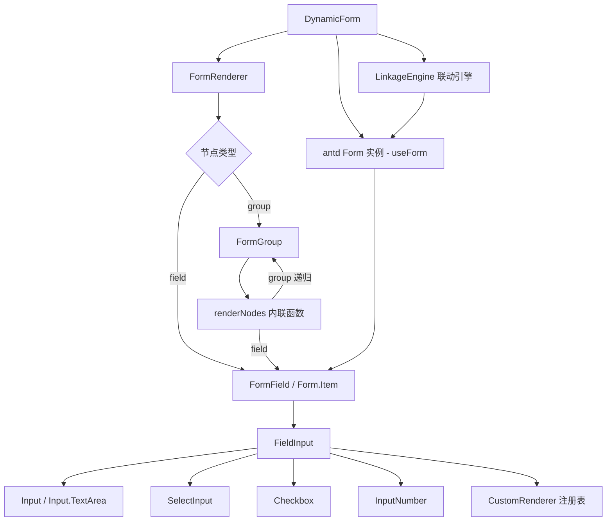
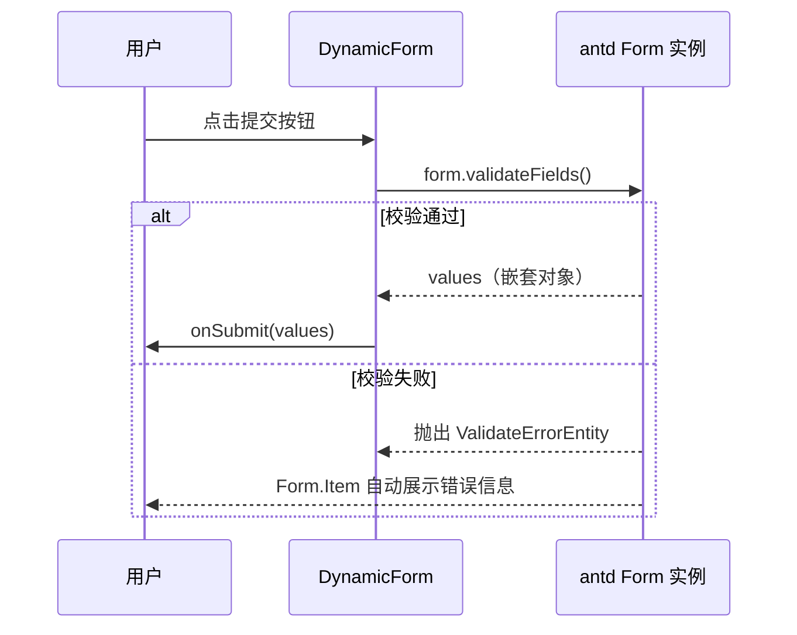
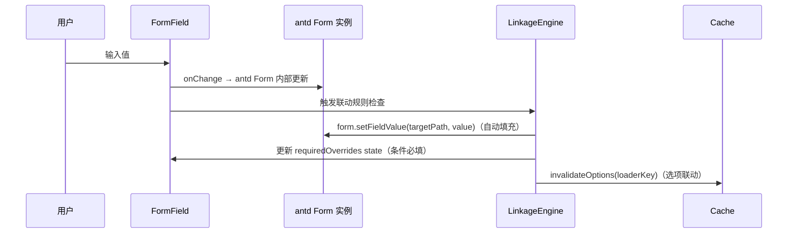
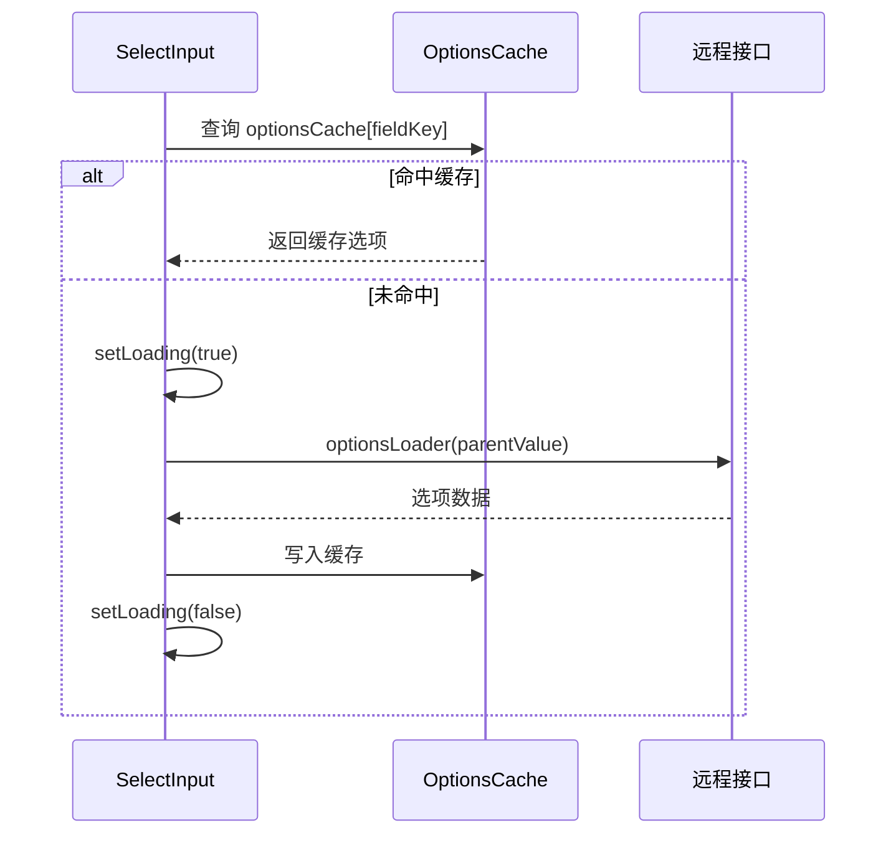

# 一个基于React 19 + TypeScript + Ant Design 的可配置动态表单组件

## 概述

组件（`DynamicForm`）支持通过 JSON Schema 驱动渲，染具备表单项分组（Group）和任意深度嵌套（Nested Group）能力。

**核心设计原则**：配置驱动、递归自相似性、关注点分离、**不重复造轮子**。

校验、字段值收集、提交、重置、错误展示全部委托给 **Ant Design `Form` 组件的原生 API**（`form.validateFields()`、`form.getFieldsValue()`、`form.setFieldsValue()`、`form.resetFields()`），组件本身只负责 Schema 解析与递归渲染。

---

## :ice_cube: 架构



> `FormGroup` 通过内联 `renderNodes` 函数递归渲染子节点，避免与 `FormRenderer` 产生循环导入。

---

## 核心设计：复用 Ant Design Form API

### 字段名（name）与路径

antd `Form.Item` 的 `name` prop 支持数组形式，天然支持嵌套路径。本组件将 Schema 的层级 key 转换为数组路径传给 `Form.Item`：

```typescript
// buildPath 返回字符串路径，用于 showTotal 等计算
buildPath('basic', 'name') → 'basic.name'

// antd Form.Item 使用数组路径，支持嵌套取值
<Form.Item name={['basic', 'name']} label="姓名">
  <Input />
</Form.Item>
```

`Form.getFieldsValue(true)` 返回嵌套对象，`Form.getFieldValue(['basic', 'name'])` 精确读取单个字段。

### 校验规则映射

`FieldNode.validation` 直接映射为 antd `Form.Item` 的 `rules` 数组，无需自定义校验函数：

```typescript
function buildAntdRules(
  validation: ValidationRule,
  isRequired: boolean,
): Rule[] {
  const rules: Rule[] = [];

  if (isRequired || validation.required) {
    rules.push({
      required: true,
      message: validation.message ?? "此字段为必填项",
    });
  }
  if (validation.min !== undefined || validation.max !== undefined) {
    rules.push({
      type: "number",
      min: validation.min,
      max: validation.max,
      message: validation.message,
    });
  }
  if (
    validation.minLength !== undefined ||
    validation.maxLength !== undefined
  ) {
    rules.push({
      min: validation.minLength,
      max: validation.maxLength,
      message: validation.message,
    });
  }
  if (validation.pattern) {
    rules.push({
      pattern: new RegExp(validation.pattern),
      message: validation.message ?? "格式不符合要求",
    });
  }
  return rules;
}
```

### 提交与重置

```typescript
// 提交：antd Form 负责校验 + 收集值
async function handleSubmit() {
  try {
    const values = await form.validateFields(); // 校验失败自动展示错误
    onSubmit?.(values);
  } catch {
    // 校验失败，antd 已自动在 Form.Item 下方展示错误信息，无需额外处理
  }
}

// 重置：antd Form 负责清空值和错误
function handleReset() {
  form.resetFields();
}
```

---

## 序列图

### 表单提交流程



### 字段值变更与联动流程



### 异步选项加载流程



---

## 数据模型

### Schema 类型定义

```typescript
type BuiltinFieldType = "text" | "number" | "select" | "checkbox" | "textarea";
type FieldType = BuiltinFieldType | string;

type FieldValue = string | number | boolean | null;

// 校验规则（映射到 antd Form.Item rules）
interface ValidationRule {
  required?: boolean;
  min?: number; // 数值最小值 或 字符串最小长度
  max?: number; // 数值最大值 或 字符串最大长度
  minLength?: number; // 字符串最小长度（与 min 区分）
  maxLength?: number; // 字符串最大长度
  pattern?: string; // 正则字符串
  message?: string; // 自定义错误信息
}

interface FieldOption {
  label: string;
  value: string | number;
  parentCode?: string;
  parentName?: string;
}

interface LinkageConfig {
  reloadOptions?: string[];
  autofill?: Record<
    string,
    (value: FieldValue, option?: FieldOption) => FieldValue
  >;
  conditionalRequired?: {
    targets: string[];
    condition: (value: FieldValue) => boolean;
  };
}

interface FieldNode {
  type: "field";
  key: string;
  label: string;
  fieldType: FieldType;
  defaultValue?: FieldValue;
  placeholder?: string;
  disabled?: boolean;
  options?: FieldOption[];
  optionsLoader?: string;
  validation?: ValidationRule;
  description?: string;
  linkage?: LinkageConfig;
}

interface GroupNode {
  type: "group";
  key: string;
  label: string;
  description?: string;
  collapsible?: boolean;
  defaultCollapsed?: boolean;
  titleLevel?: 1 | 2 | 3 | 4;
  showTotal?: boolean;
  layout?: "column" | "grid" | "flex";
  children: FormNode[];
}

type FormNode = FieldNode | GroupNode;

interface FormSchema {
  nodes: FormNode[];
}

type CustomRendererMap = Record<string, React.FC<FieldInputProps>>;
```

---

## :ice_cube: 组件与接口

### DynamicForm

顶层组件，持有 antd `Form` 实例，处理提交与重置。

```typescript
interface DynamicFormProps {
  schema: FormSchema;
  initialValues?: Record<string, unknown>; // 直接传给 antd Form initialValues
  onSubmit?: (values: Record<string, unknown>) => void;
  onChange?: (
    changedValues: Record<string, unknown>,
    allValues: Record<string, unknown>,
  ) => void;
  customRenderers?: CustomRendererMap;
  disabled?: boolean;
  submitText?: string;
  resetText?: string;
}
```

**实现要点**：

- 使用 `Form.useForm()` 创建 form 实例
- 挂载时执行 `detectCycle(schema.nodes)`，检测到循环引用则渲染 `Alert` 错误占位
- `Form` 的 `onValuesChange` 触发联动引擎
- 开发环境检测同层重复 key

### FormField（Form.Item 包裹）

每个叶子字段渲染为一个 `Form.Item`，`name` 使用数组路径，`rules` 由 `buildAntdRules` 生成。

```typescript
// FormField 核心结构
<Form.Item
  name={pathArray}           // ['basic', 'name']
  label={node.label}
  rules={buildAntdRules(node.validation, isRequired)}
  tooltip={node.description}
>
  <FieldInput node={node} disabled={disabled} />
</Form.Item>
```

条件必填（`requiredOverrides`）通过组件内部 `useState` 维护，`Form.Item` 的 `rules` 在渲染时动态计算。

### FormGroup（Card 包裹）

使用 antd `Card` 渲染分组，支持折叠、布局模式、数值总计。总计值通过 `Form.useWatch` 订阅相关字段实时计算。

```typescript
// 使用 Form.useWatch 订阅数值字段，实时计算总计
const q1 = Form.useWatch(["budget", "q1"], form);
const q2 = Form.useWatch(["budget", "q2"], form);
const total = (q1 ?? 0) + (q2 ?? 0);
```

> 通用方案：`computeGroupTotal` 函数接收 `form.getFieldsValue()` 的快照计算总计，在 `Form` 的 `onValuesChange` 中触发更新。

---

## 核心算法与函数规范

### 路径构建算法

```typescript
// 字符串路径：用于 showTotal 计算、联动 key 匹配
function buildPath(parentPath: string, key: string): string;

// 数组路径：用于 antd Form.Item name prop
function buildPathArray(parentPath: string[], key: string): string[];
```

**示例**：

```
buildPath('', 'name')           → 'name'
buildPath('basic', 'name')      → 'basic.name'

buildPathArray([], 'name')      → ['name']
buildPathArray(['basic'], 'name') → ['basic', 'name']
```

### 循环引用检测算法

```typescript
function detectCycle(nodes: FormNode[], visited?: Set<string>): boolean;
```

DFS 遍历 Schema，检测到重复 key 则返回 `true`。`DynamicForm` 挂载时执行一次。

### 递归总计值计算算法

```typescript
function computeGroupTotal(
  nodes: FormNode[],
  values: Record<string, unknown>,
  parentPath: string,
): number;
```

递归累加 `number` 类型叶子字段的当前值，在 `Form.onValuesChange` 回调中触发重新计算。

### 校验规则映射

```typescript
function buildAntdRules(
  validation: ValidationRule | undefined,
  isRequired: boolean,
): Rule[];
```

将 `ValidationRule` 转换为 antd `Rule[]`，直接传给 `Form.Item rules`，无需自定义校验逻辑。

---

## 字段联动机制

联动引擎在 `Form.onValuesChange` 中触发，通过 `form` 实例操作字段值。

### 模式 1：选项联动

父字段变化时，清除子字段选项缓存，子字段下次打开下拉框时重新加载。

```typescript
// onValuesChange 中
if (node.linkage?.reloadOptions) {
  for (const targetKey of node.linkage.reloadOptions) {
    invalidateOptions(targetKey);
  }
}
```

### 模式 2：自动填充

```typescript
// 使用 form.setFieldValue 填充目标字段
if (node.linkage?.autofill) {
  for (const [targetPath, fillFn] of Object.entries(node.linkage.autofill)) {
    form.setFieldValue(targetPath.split("."), fillFn(value, option));
  }
}
```

### 模式 3：条件必填

通过组件内部 `requiredOverrides` state 控制，`Form.Item rules` 在渲染时动态合并：

```typescript
const [requiredOverrides, setRequiredOverrides] = useState<
  Record<string, boolean>
>({});

// onValuesChange 中
if (node.linkage?.conditionalRequired) {
  const { targets, condition } = node.linkage.conditionalRequired;
  const required = condition(value);
  setRequiredOverrides((prev) => {
    const next = { ...prev };
    targets.forEach((t) => {
      next[t] = required;
    });
    return next;
  });
}
```

---

## 选项缓存机制

```typescript
// optionsCache.ts（模块级单例）
const optionsCache = new Map<string, FieldOption[]>();

export async function loadOptions(
  loaderKey: string,
  loader: OptionsLoader,
  parentValue?: FieldValue,
): Promise<FieldOption[]>;

export function invalidateOptions(loaderKey: string): void;
```

每个 `SelectInput` 维护独立的 `loading` state，通过 `onFocus` 触发异步加载。

---

## 自定义字段类型注册机制

```typescript
// FieldInput 优先查找 customRenderers，回退到内置渲染器
export function FieldInput({ node, customRenderers, ...props }: FieldInputProps) {
  const Renderer = customRenderers?.[node.fieldType] ?? builtinRenderers[node.fieldType];
  if (!Renderer) {
    console.warn(`[DynamicForm] 未知字段类型: ${node.fieldType}`);
    return null;
  }
  return <Renderer node={node} {...props} />;
}
```

---

## 布局模式

| layout 值 | 说明             | inline style                                                                                 |
| --------- | ---------------- | -------------------------------------------------------------------------------------------- |
| `column`  | 垂直堆叠（默认） | `{ display: 'flex', flexDirection: 'column' }`                                               |
| `grid`    | 网格布局         | `{ display: 'grid', gridTemplateColumns: 'repeat(auto-fill, minmax(240px, 1fr))', gap: 16 }` |
| `flex`    | 弹性横排         | `{ display: 'flex', flexWrap: 'wrap', gap: 16 }`                                             |

内容基于真实项目实践整理提炼，用于理解复杂组件的设计方法以及实现思路！
