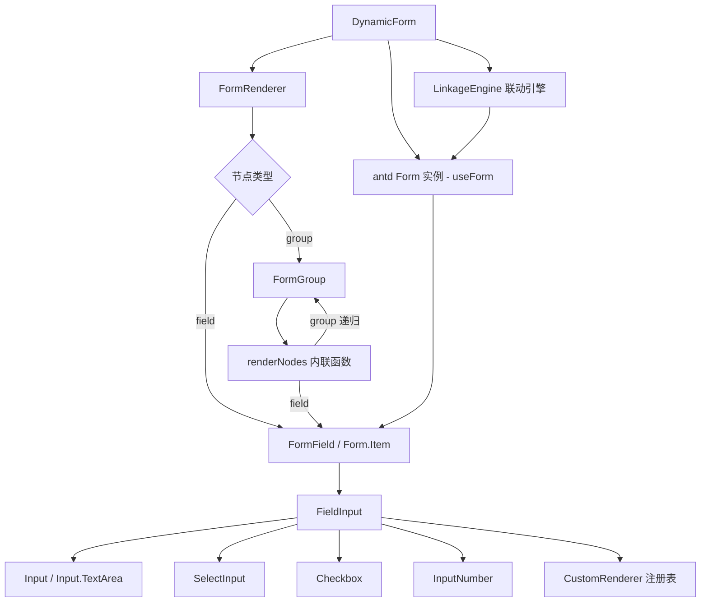
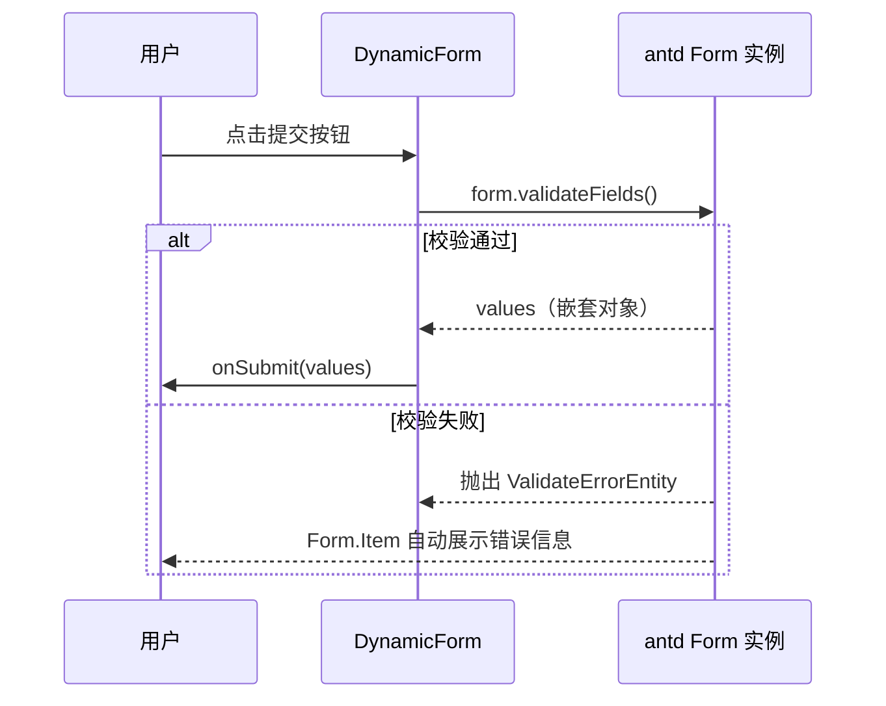
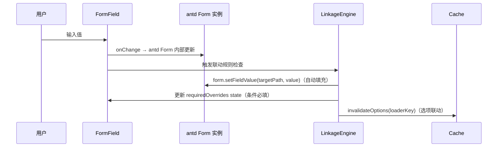
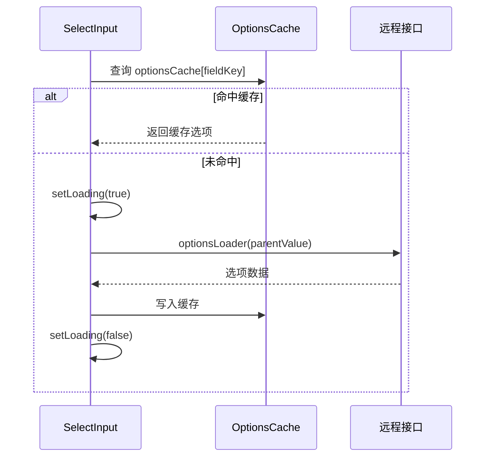

# 一个基于React 19 + TypeScript + Ant Design 的可配置动态表单组件

## 概述

组件（`DynamicForm`）支持通过 JSON Schema 驱动渲染，具备表单项分组（Group）和任意深度嵌套（Nested Group）能力。

**核心设计原则**：配置驱动、递归自相似性、关注点分离、**不重复造轮子**。

校验、字段值收集、提交、重置、错误展示全部委托给 **Ant Design `Form` 组件的原生 API**（`form.validateFields()`、`form.getFieldsValue()`、`form.setFieldsValue()`、`form.resetFields()`），组件本身只负责 Schema 解析与递归渲染。

---

## :ice_cube: 架构



> `FormGroup` 通过内联 `renderNodes` 函数递归渲染子节点，避免与 `FormRenderer` 产生循环导入。

## 核心设计

## 交互与数据流

### 表单提交流程



### 字段值变更与联动流程



### 异步选项加载流程



---

## 数据模型

### Schema 类型定义

```typescript
/** 字段节点：描述单个表单字段 */
export interface FieldNode {
  type: "field";
  /** 字段唯一 key */
  key: string;
  /** 字段标签 */
  label: string;
  /** 字段类型 */
  fieldType: FieldType;
  /** 默认值 */
  defaultValue?: FieldValue;
  /** 占位文本 */
  placeholder?: string;
  /** 是否禁用 */
  disabled?: boolean;
  /** 静态选项列表（select 类型使用） */
  options?: FieldOption[];
  /** 异步选项加载器 key（select 类型使用） */
  optionsLoader?: string;
  /** 校验规则 */
  validation?: ValidationRule;
  /** 字段描述（展示为 tooltip） */
  description?: string;
  /** 联动配置 */
  linkage?: LinkageConfig;
}

/** 分组节点：描述表单字段分组，支持嵌套 */
export interface GroupNode {
  type: "group";
  /** 分组唯一 key */
  key: string;
  /** 分组标题 */
  label: string;
  /** 分组描述 */
  description?: string;
  /** 是否支持折叠 */
  collapsible?: boolean;
  /** 是否默认折叠（需 collapsible 为 true） */
  defaultCollapsed?: boolean;
  /** 标题层级（1~4），未设置时按嵌套深度自动推断 */
  titleLevel?: 1 | 2 | 3 | 4;
  /** 是否显示组内数值总计 */
  showTotal?: boolean;
  /** 子节点布局模式 */
  layout?: "column" | "grid" | "flex";
  /** 子节点列表 */
  children: FormNode[];
}

/** 表单节点联合类型 */
export type FormNode = FieldNode | GroupNode;
```

---

## :ice_cube: 组件与接口

### DynamicForm

顶层组件，持有 antd `Form` 实例，处理提交与重置

**Props**：

```typescript
export interface DynamicFormProps {
  /** 表单 Schema（必填） */
  schema: FormSchema;
  /** 初始值，直接传给 antd Form initialValues */
  initialValues?: Record<string, unknown>;
  /** 提交回调，仅在校验通过时调用 */
  onSubmit?: (values: Record<string, unknown>) => void;
  /** 字段值变更回调 */
  onChange?: (
    changedValues: Record<string, unknown>,
    allValues: Record<string, unknown>,
  ) => void;
  /** 自定义字段渲染器 */
  customRenderers?: CustomRendererMap;
  /** 是否整体禁用表单 */
  disabled?: boolean;
  /** 提交按钮文字 */
  submitText?: string;
  /** 重置按钮文字 */
  resetText?: string;
  loaderRegistry?: Record<string, OptionsLoader>; // select options loader
}
```

**实现要点**：

- 使用 `Form.useForm()` 创建 form 实例
- 挂载时执行 `checkDuplicateKeys(schema.nodes)`，检测同层重复 key，发现重复则渲染 `Alert` 错误占位，保证同层表单项字段的唯一性
- `Form` 的 `onValuesChange` 触发联动引擎

### FormGroup（Card 包裹）

使用 antd `Card` 渲染分组，支持折叠、布局模式、数值总计。总计值通过 `Form.useWatch` 订阅相关字段实时计算。

```typescript
// 使用 Form.useWatch 订阅相关字段值变化，实时计算总计
const fullPath = [...parentPath, node.key];
const allValues = Form.useWatch(fullPath, form) as
  | Record<string, unknown>
  | undefined;

// 计算分组内所有字段的总计值
const total = node.showTotal
  ? computeGroupTotal(node.children, allValues ?? {}, node.key)
  : null;
```

> - 其它通用方案：`computeGroupTotal` 函数接收 `form.getFieldsValue()` 的快照计算总计，在 `Form` 的 `onValuesChange` 中触发更新。

> - 这里`useWatch`精确监听当前分组及其所有子分组内的字段值变化，相比form.getFieldsValue()获取整个表单值性能更优。

### FormField（Form.Item 包裹）

每个叶子字段渲染为一个 `Form.Item`，`name` 使用数组路径，支持不同的分组中渲染相同字段， `rules` 由 `buildAntdRules` 生成。

```typescript
// FormField 核心结构
<Form.Item
  name={pathArray}           // ['basic', 'name']
  label={node.label}
  rules={buildAntdRules(node.validation, isRequired)}
  tooltip={node.description}
>
  <FieldInput node={node} disabled={disabled} />
</Form.Item>
```

条件必填（`requiredOverrides`）通过组件内部 `useState` 维护，`Form.Item` 的 `rules` 在渲染时动态计算。

### FieldInput组件

支持自定义字段组件渲染

```typescript

// 优先查找自定义渲染器
  if (customRenderers?.[node.fieldType]) {
    const CustomRenderer = customRenderers[node.fieldType];
    return (
      <CustomRenderer />
    );
  }
  // 内置渲染器
  switch (node.fieldType) {
    case 'text':
      return <Input />
  }
```

---

## 核心算法与函数规范

### 重复key检测算法

```typescript
export function checkDuplicateKeys(
  nodes: FormNode[],
  visited?: Set<string>,
): boolean {
  const seen = visited ?? new Set<string>();

  for (const node of nodes) {
    if (seen.has(node.key)) {
      return true;
    }
    seen.add(node.key);

    if (node.type === "group") {
      if (detectCycle(node.children, seen)) {
        return true;
      }
    }
  }

  return false;
}
```

DFS 遍历 Schema，检测到重复 key 则返回 `true`。`DynamicForm` 挂载时执行一次。

### 递归总计值计算算法

```typescript
export function computeGroupTotal(
  nodes: FormNode[],
  values: Record<string, unknown>,
): number {
  return nodes.reduce((total, node) => {
    if (node.type === "field" && node.fieldType === "number") {
      // 提取 number 类型字段的值，非数字视为 0
      const value = values[node.key];
      return total + (typeof value === "number" ? value : 0);
    }

    if (node.type === "group") {
      // 递归计算子分组的总计
      const childValues = values[node.key];
      if (
        childValues !== null &&
        typeof childValues === "object" &&
        !Array.isArray(childValues)
      ) {
        return (
          total +
          computeGroupTotal(
            node.children,
            childValues as Record<string, unknown>,
          )
        );
      }
    }

    return total;
  }, 0);
}
```

递归累加 `number` 类型叶子字段的当前值，通过`useWatch`监听分组字段值改变，触发重渲染计算。

### 校验规则映射

```typescript
function buildAntdRules(
  validation: ValidationRule | undefined,
  isRequired: boolean,
): Rule[];
```

将 `ValidationRule` 转换为 antd `Rule[]`，直接传给 `Form.Item rules`，无需自定义校验逻辑。

---

## 字段联动机制

联动引擎在 `Form.onValuesChange` 中触发，通过 `form` 实例操作字段值。

### 模式 1：选项联动

父字段变化时，清除子字段选项缓存，子字段下次打开下拉框时重新加载。

```typescript
// onValuesChange 中
if (node.linkage?.reloadOptions) {
  for (const targetKey of node.linkage.reloadOptions) {
    invalidateOptions(targetKey);
  }
}
```

### 模式 2：自动填充

```typescript
// 使用 form.setFieldValue 填充目标字段
if (node.linkage?.autofill) {
  for (const [targetPath, fillFn] of Object.entries(node.linkage.autofill)) {
    form.setFieldValue(targetPath.split("."), fillFn(value, option));
  }
}
```

### 模式 3：条件必填

通过组件内部 `requiredOverrides` state 控制，`Form.Item rules` 在渲染时动态合并：

```typescript
const [requiredOverrides, setRequiredOverrides] = useState<
  Record<string, boolean>
>({});

// onValuesChange 中
if (node.linkage?.conditionalRequired) {
  const { targets, condition } = node.linkage.conditionalRequired;
  const required = condition(value);
  setRequiredOverrides((prev) => {
    const next = { ...prev };
    targets.forEach((t) => {
      next[t] = required;
    });
    return next;
  });
}
```

---

## 选项缓存机制

```typescript
// optionsCache.ts（模块级单例）
const optionsCache = new Map<string, FieldOption[]>();

export async function loadOptions(
  loaderKey: string,
  loader: OptionsLoader,
  parentValue?: FieldValue,
): Promise<FieldOption[]>;

export function invalidateOptions(loaderKey: string): void;
```

每个 `SelectInput` 维护独立的 `loading` state，通过 `onFocus` 触发异步加载。

---

## 自定义字段类型注册机制

```typescript
// FieldInput 优先查找 customRenderers，回退到内置渲染器
export function FieldInput({ node, customRenderers, ...props }: FieldInputProps) {
  const Renderer = customRenderers?.[node.fieldType] ?? builtinRenderers[node.fieldType];
  if (!Renderer) {
    console.warn(`[DynamicForm] 未知字段类型: ${node.fieldType}`);
    return null;
  }
  return <Renderer node={node} {...props} />;
}
```

---

## 布局模式

| layout 值 | 说明             | inline style                                                                                 |
| --------- | ---------------- | -------------------------------------------------------------------------------------------- |
| `column`  | 垂直堆叠（默认） | `{ display: 'flex', flexDirection: 'column' }`                                               |
| `grid`    | 网格布局         | `{ display: 'grid', gridTemplateColumns: 'repeat(auto-fill, minmax(240px, 1fr))', gap: 16 }` |
| `flex`    | 弹性横排         | `{ display: 'flex', flexWrap: 'wrap', gap: 16 }`                                             |

内容基于真实项目实践整理提炼，用于理解复杂组件的设计方法以及实现思路！
