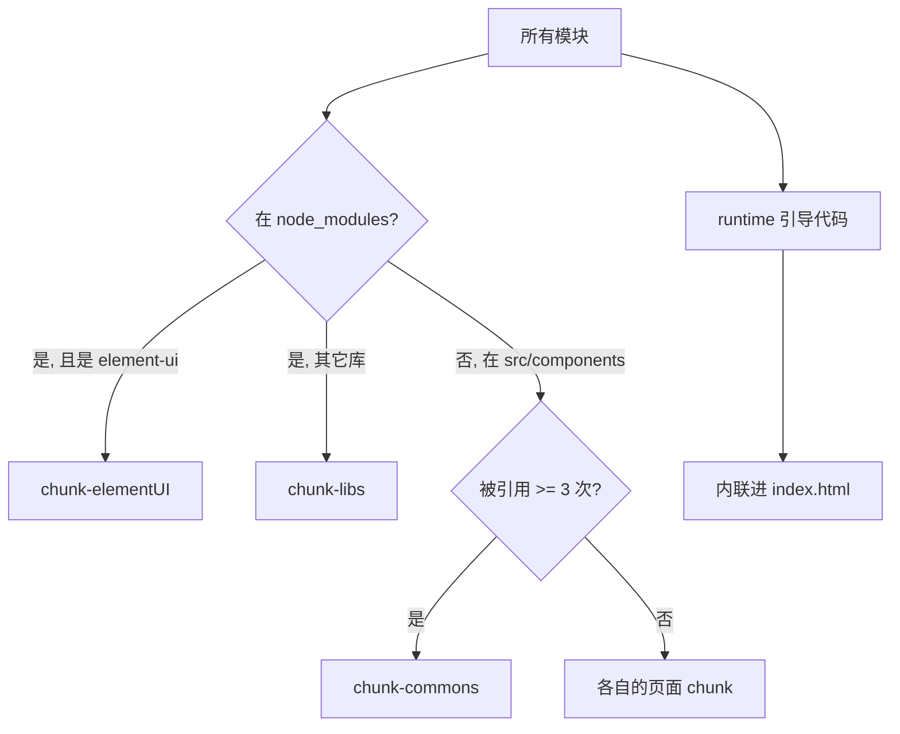

# 一段 Vue CLI 构建配置里藏着的分包哲学

**下面这段十几行的 `vue.config.js` 配置，决定了项目打包后是"一个 3MB 的巨石"还是"几个能被浏览器长期缓存的小块"。** 它做了三件事：把运行时（runtime）内联进 HTML、把代码按"第三方库 / UI 组件库 / 公共组件"三层切分、再把 webpack 运行时单独抽出。这篇文章逐行拆开它，讲清楚每个配置项到底在优化什么、为什么这么切。

先上代码，后面逐段对照解释：

```js
config.when(process.env.NODE_ENV !== 'development', (config) => {
  config
    .plugin('ScriptExtHtmlWebpackPlugin')
    .after('html')
    .use('script-ext-html-webpack-plugin', [
      {
        // `runtime` must same as runtimeChunk name. default is `runtime`
        inline: /runtime\..*\.js$/
      }
    ])
    .end()

  config.optimization.splitChunks({
    chunks: 'all',
    cacheGroups: {
      libs: {
        name: 'chunk-libs',
        test: /[\\/]node_modules[\\/]/,
        priority: 10,
        chunks: 'initial'
      },
      elementUI: {
        name: 'chunk-elementUI',
        priority: 20,
        test: /[\\/]node_modules[\\/]_?element-ui(.*)/
      },
      commons: {
        name: 'chunk-commons',
        test: resolve('src/components'),
        minChunks: 3,
        priority: 5,
        reuseExistingChunk: true
      }
    }
  })

  config.optimization.runtimeChunk('single')
})
```

这段代码用的是 `webpack-chain` 语法——Vue CLI 用它以链式调用的方式改写底层 webpack 配置，比直接写庞大的配置对象更好维护。

## 为什么要分包：一个巨石文件的三宗罪

先说清楚我们在跟什么较劲。假设不做任何分包，webpack 会把你的业务代码、`element-ui`、`lodash`、`axios` 全塞进一个 `app.js`。这带来三个问题：

- **首屏太重**：用户打开首页只用到 10% 的代码，却要下载 100% 的体积。
- **缓存全废**：你改了一行业务代码重新发版，整个大文件哈希变了，用户之前缓存的 `element-ui`（半年没动过）也得重新下载。
- **无法并行**：一个大文件只能串行下载，切成多个小文件浏览器能并发拉取。

分包的核心目标就一句话:**让"变得频繁"的代码和"几乎不变"的代码分开,各自享有独立的缓存生命周期。**

## 第一处：只在生产环境生效

```js
config.when(process.env.NODE_ENV !== 'development', (config) => { ... })
```

`config.when` 是 webpack-chain 提供的条件语法,第一个参数为 `true` 时才执行回调里的配置。

这里判断"非 development 环境",意味着**分包和运行时内联只在生产构建时开启**。开发环境跳过它们是有意为之——开发时我们要的是快速的热更新（HMR）和清晰的 source map，把包切得七零八落反而拖慢 rebuild、干扰调试。优化是给上线用户的,不是给开发者自己的。

## 第二处：把 runtime 内联进 HTML

```js
config
  .plugin('ScriptExtHtmlWebpackPlugin')
  .after('html')
  .use('script-ext-html-webpack-plugin', [
    { inline: /runtime\..*\.js$/ }
  ])
```

这里要和最后一行配套理解:

```js
config.optimization.runtimeChunk('single')
```

`runtimeChunk('single')` 让 webpack 把**运行时代码**单独抽成一个 `runtime.[hash].js`。所谓运行时,是 webpack 用来加载、拼接各个 chunk 的一小段引导逻辑——它记录了"哪个模块在哪个文件里"这份映射表。

问题在于:这份映射表每次构建都会变（因为其它 chunk 的哈希变了）。如果它跟业务代码打在一起,会污染业务代码的缓存;如果单独成文件,它虽然很小(通常几 KB),却要多发一个 HTTP 请求。

`script-ext-html-webpack-plugin` 的 `inline` 配置就是来解决"多一个请求"的:它匹配 `runtime.xxx.js`,把这个小文件的内容**直接内联进 HTML 的 `<script>` 标签**。于是我们既拿到了"运行时独立、不污染业务缓存"的好处,又省掉了一次网络往返。

> 注意注释里那句 `runtime must same as runtimeChunk name`——`inline` 的正则要匹配上 `runtimeChunk` 生成的文件名(默认就叫 `runtime`),两者对不上就内联不成功。

## 第三处：splitChunks 三层切分

这是整段配置的重头戏。`chunks: 'all'` 表示对同步和异步引入的模块都参与拆分,然后通过 `cacheGroups` 定义了三个"分组规则"。

理解 `cacheGroups` 的关键是三个字段:`test`(命中哪些模块)、`priority`(优先级,数字越大越优先)、以及各自的命中条件。一个模块可能同时满足多条规则,这时 `priority` 决定它最终归到哪个组。

我们按优先级从高到低看:

**elementUI(priority: 20)——把 UI 库单独关起来**

```js
elementUI: {
  name: 'chunk-elementUI',
  priority: 20,
  test: /[\\/]node_modules[\\/]_?element-ui(.*)/
}
```

`element-ui` 也在 `node_modules` 里,理论上也会命中下面的 `libs` 规则。但它的 `priority` 是 20,比 `libs` 的 10 高,所以会被**优先**抽到 `chunk-elementUI`。

为什么要给它开小灶?因为 UI 组件库通常体积大、版本稳定。把它和其它零散的第三方库分开,意味着只要你不升级 `element-ui`,这个文件的哈希就不变,用户可以长期缓存。正则里的 `_?` 是为了兼容 cnpm——cnpm 安装的包路径可能带 `_` 前缀。

**libs(priority: 10)——其余第三方库**

```js
libs: {
  name: 'chunk-libs',
  test: /[\\/]node_modules[\\/]/,
  priority: 10,
  chunks: 'initial'
}
```

除了 `element-ui` 之外的所有 `node_modules` 依赖(`axios`、`vuex`、`vue-router` 等)都归到这里。`chunks: 'initial'` 限定只处理**初始加载时同步依赖**的库——异步动态导入的库交给默认拆分逻辑,不硬塞进这个初始包,避免首屏包越滚越大。

**commons(priority: 5)——被多处复用的业务组件**

```js
commons: {
  name: 'chunk-commons',
  test: resolve('src/components'),
  minChunks: 3,
  priority: 5,
  reuseExistingChunk: true
}
```

这一组盯的是你自己写的 `src/components`。`minChunks: 3` 是核心:**只有被 3 个及以上的地方引用的组件,才会被抽进公共包。** 一个只在单页面用一次的组件没必要单拎出来——那反而多一个请求。`reuseExistingChunk: true` 则表示如果某模块已被抽进别的 chunk,就直接复用,不重复打包。

## 三层切分后,包长什么样

把上面的规则串起来,一次生产构建大致会产出这样几类文件:



对应到缓存收益就很清晰了:

- 改一行业务逻辑 → 只有页面 chunk 变,`chunk-libs`、`chunk-elementUI` 全部命中缓存。
- 升级一个小工具库 → 只有 `chunk-libs` 变,UI 库和公共组件缓存不受影响。
- runtime 每次都变,但它内联在 HTML 里,本来就是每次请求 HTML 都会带上,不占额外缓存。

## 几个容易踩的坑

配置本身不复杂,但实际用起来有几个点值得留意:

- **优先级写反了**：如果 `elementUI` 的 `priority` 没设得比 `libs` 高,`element-ui` 就会被 `libs` 先命中,单独分包的意图落空。数字大小关系一定要理清。
- **过度拆分**：不是分得越细越好。每个 chunk 都是一个 HTTP 请求,切太碎在弱网下反而更慢。`minChunks: 3` 这类阈值就是在"复用收益"和"请求数量"之间做平衡。
- **`element-ui` 已经是旧版生态**：这套配置是典型的 Vue 2 + Element UI 项目写法。如果你在写 Vue 3 项目,对应的库应换成 `element-plus`,正则也要相应调整;而且现代构建工具(如 Vite)默认的分包策略已经相当聪明,很多时候不需要手写这么细。
- **想验证效果**：装个 `webpack-bundle-analyzer`,构建后能直观看到每个 chunk 里到底装了什么、多大,比盲猜可靠得多。

## 小结

这段配置虽短,却完整体现了前端构建优化的核心思路:

- **按变更频率分层**:第三方库(几乎不变)、UI 库(偶尔升级)、公共组件(随业务变),各自独立成包、独立缓存。
- **优先级决定归属**:多条 `cacheGroups` 命中同一模块时,`priority` 高的赢,这是给 `element-ui` 开小灶的关键。
- **runtime 单独抽 + 内联**:既隔离了运行时对业务缓存的污染,又用内联省掉一次请求。
- **只在生产生效**:开发环境保留完整的 HMR 与调试体验,不为优化牺牲开发效率。

如果你手上正好有个 Vue 2 老项目首屏加载慢,可以先跑一次 bundle 分析,看看是不是所有东西都糊在一个大文件里——多半这套三层切分就能立竿见影地改善缓存命中率。

## 延伸阅读

- [webpack 官方文档:SplitChunksPlugin](https://webpack.js.org/plugins/split-chunks-plugin/)
- [webpack-chain 语法](https://github.com/neutrinojs/webpack-chain)
- [Vue CLI:webpack 相关配置](https://cli.vuejs.org/zh/guide/webpack.html)