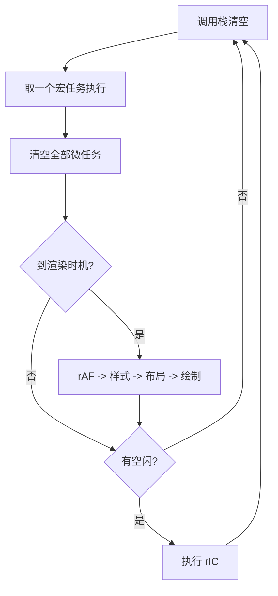
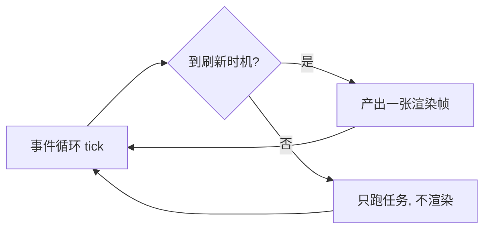
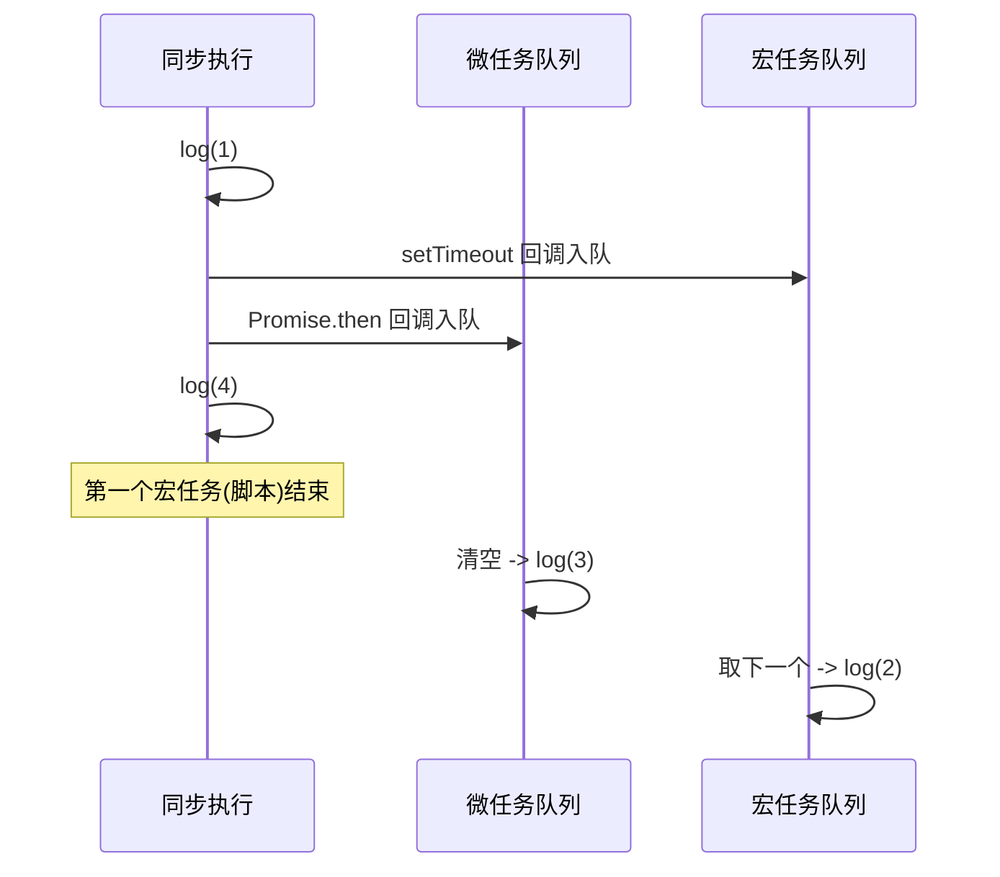

# 事件循环、栈帧、渲染帧：三个"帧"到底是不是一回事

看下面这段代码，不运行，先在脑子里说出输出顺序：

```js
console.log(1);
setTimeout(() => console.log(2));
Promise.resolve().then(() => console.log(3));
console.log(4);
```

如果你答的是 `1 4 2 3`，那这篇就是写给你的。正确答案是 `1 4 3 2`——为什么 Promise 的 `3` 会插到 `setTimeout` 的 `2` 前面？

顺带一提，中文里有三个词都叫"帧"：调用栈里的**栈帧（stack frame）**、屏幕刷新的**渲染帧（frame）**、还有口语里说的"每一帧执行"。它们指的是完全不同的东西，混在一起是很多人理解卡壳的根源。这篇把它们一次讲清楚。

## 一句话先立住三个概念

- **事件循环**是发动机：一个永不停歇的循环，决定"接下来跑哪段代码"。
- **栈帧**是发动机内部一次函数调用的现场：参数、局部变量、返回地址。
- **渲染帧**是发动机对外的产物：按显示器节奏（常见 60Hz，约 16.7ms 一张）定期画出的一张画面。

后面三节分别展开，最后回到开头那道题。

## 一、事件循环：JS 运行时的调度中枢

### JS 引擎其实只有三样东西

很多人以为 `setTimeout`、`fetch`、操作 DOM 都是 JS 引擎（比如 V8）的能力，其实不是。引擎本体只有：

- **调用栈（Call Stack）**：同步代码在这里逐层压栈、出栈，一次只做一件事。
- **堆（Heap）**：存对象等内存分配。
- 仅此而已——**定时器、网络请求、DOM 全部由宿主环境提供**（浏览器的 Web APIs、Node 的 C++ APIs）。

正因为引擎是**单线程**的，它需要一套机制来协调"同步代码"和"异步回调"谁先谁后，这套机制就是事件循环。

### 两种任务队列：宏任务和微任务

异步回调完成后不会立刻执行，而是排进队列，等调用栈空了再取。队列分两类，这是整个机制的关键：

| 队列 | 谁进这个队列 |
|---|---|
| 宏任务（macrotask） | `setTimeout`、`setInterval`、事件回调、I/O、`MessageChannel`，以及**整段 script 脚本本身** |
| 微任务（microtask） | `Promise.then`、`queueMicrotask`、`MutationObserver` |

还有一类特殊回调 `requestAnimationFrame`（rAF）和 `requestIdleCallback`（rIC），跟渲染绑定，第三节再说。

### 一轮循环（tick）到底做了什么

事件循环的一轮，顺序是固定的：

```
调用栈清空
   ↓
取【一个】宏任务执行（期间产生的微任务先入队，不打断）
   ↓
清空【全部】微任务（清微任务时新产生的微任务也一起清掉）
   ↓
（到渲染时机?）执行 rAF → 样式计算 → 布局 → 绘制
   ↓
（有空闲?）执行 rIC
   ↓
回到开头，取下一个宏任务
```

用一句话记住这个节奏：**一轮只吃一个宏任务，但会把整个微任务队列榨干。**



这里最容易被忽略的一点：**"清空全部微任务"发生在"取下一个宏任务"之前**。所以哪怕你连续写一百个 `Promise.then`，它们也会在下一个 `setTimeout` 回调之前全部执行完。这正是开头那道题的答案来源，我们最后回收。

## 二、栈帧：一次函数调用的"现场"

第一节里反复出现"调用栈"，那栈里装的一格一格是什么？答案就是**栈帧（stack frame）**。

**每调用一个函数，就在调用栈上创建一个栈帧**——它保存这次调用的参数、局部变量、返回地址（执行完回到哪里）。函数调用时压栈（push），函数返回时出栈（pop）。所以"逐帧压栈/出栈"里的一"帧"，就是**一次函数调用**。

看这段代码，注意哪些语句会产生栈帧：

```html
<script>
  let num = 1;
  if (num) { console.log('w'); }
  function a() { b(); console.log('a done'); }
  function b() { c(); }
  function c() { console.log('c'); }
  a();
</script>
```

浏览器执行 `<script>` 时，先创建一个**全局执行上下文**压入栈底，你写的所有代码都跑在这一帧内部。关键区分在于：**只有函数调用才会新增栈帧**。

| 代码 | 是否新增栈帧 | 说明 |
|---|---|---|
| `let num = 1` | ❌ | 变量声明/赋值，在当前帧内完成 |
| `if (num) {...}` | ❌ | 控制流语句，不是函数调用 |
| `console.log(...)` | ✅（短暂） | 函数调用：压帧 → 执行 → 出帧 |
| `a()` / `b()` / `c()` | ✅ | 函数调用，逐层往上叠 |

完整的压栈/出栈过程：

```
1. script 开始 → 压入【全局帧】
   ├─ let num = 1              (全局帧内，无新帧)
   ├─ if(num) → console.log('w')
   │     → 压【console.log 帧】→ 打印 w → pop
   └─ a()
        → 压【a 帧】
             └─ b() → 压【b 帧】
                  └─ c() → 压【c 帧】
                       └─ console.log('c') → 压帧 → 打印 c → pop
                  → c 结束 pop → b 结束 pop
             → 回到 a，console.log('a done') → 压帧 → 打印 → pop
        → a 结束 pop
2. script 执行完
```

顺便澄清一个存储问题：`num = 1` 是原始值，直接存在全局帧的作用域记录里；如果是 `let obj = {}`，对象实体存在**堆**里，栈帧里只放一个指向堆的引用。栈存"现场"，堆存"大块数据"，两者分工不同。

**栈帧和渲染帧毫无关系**——它是函数调用层面的概念，跟屏幕刷新八竿子打不着，只是中文都翻成"帧"而已。

## 三、渲染帧：搭在事件循环里的一张画面

### 什么是一帧画面

显示器以固定频率刷新，常见 60Hz，也就是每秒 60 张画面，两次刷新之间约 16.7ms。这段时间就是一"帧"。浏览器必须在这 16.7ms 内算完这一帧该显示什么并画出来，超时就掉帧、卡顿。这里的"帧"是**渲染节奏**层面的概念。

### 渲染不是每轮循环都发生

回看第一节那张流程图里的判断节点——**"到渲染时机?"**。这说明渲染是**有条件**地插进事件循环的：

- 只有到了显示器该刷新的时机，事件循环才会在"清空微任务"之后插入 rAF + 样式计算 + 布局 + 绘制，产出一帧。
- 其余轮次只处理任务，不渲染。

所以渲染是**搭车**在事件循环里的一个环节，事件循环是驱动者，渲染帧是它的产物之一。



### 掉帧是怎么发生的

既然渲染要"搭车"，那如果某个宏任务、或一大堆微任务执行太久，把事件循环占住了会怎样？——事件循环来不及在 16.7ms 内插入渲染，这一帧就画不出来，表现为掉帧、卡顿、交互无响应。

```js
// 主线程被这个同步循环占满几百毫秒
for (let i = 0; i < 1e9; i++) { /* 重计算 */ }
// 这期间浏览器无法渲染任何一帧，页面"冻住"
```

这就是为什么 React 要做**时间切片**：把一大段计算拆成小块，每块跑完就把控制权还给事件循环，让浏览器有机会插进渲染帧，保持画面流畅。Web Worker 则是另一条路——把重计算挪到另一个线程，根本不占用主线程的事件循环。

## 四、回到开头那道题

现在我们有了全部拼图，重新拆解：

```js
console.log(1);                                 // 同步
setTimeout(() => console.log(2));               // 宏任务，进宏任务队列排队
Promise.resolve().then(() => console.log(3));   // 微任务，进微任务队列排队
console.log(4);                                 // 同步
```

**整段 script 本身就是第一个宏任务。** 执行它：

1. `console.log(1)` → 同步执行，打印 **1**
2. `setTimeout(...)` → 回调进**宏任务队列**，不执行
3. `Promise.resolve().then(...)` → 回调进**微任务队列**，不执行
4. `console.log(4)` → 同步执行，打印 **4**

此时第一个宏任务（整段脚本）执行完，调用栈清空。按照事件循环的规则——**取下一个宏任务之前，先清空全部微任务**：

5. 清微任务 → 打印 **3**
6. 微任务清空，才取下一个宏任务 → 打印 **2**

最终输出 **`1 4 3 2`**。

误区就在于把 `setTimeout` 当成"同步代码之后紧接着的下一步"。实际上它进的是宏任务队列，而 `Promise.then` 进的是微任务队列，微任务永远排在下一个宏任务之前。



## 小结

- **三个"帧"是三码事**：事件循环是发动机；栈帧是一次函数调用的现场（只有函数调用才产生栈帧）；渲染帧是发动机按显示器节奏定期输出的一张画面。
- **事件循环的一轮**：取一个宏任务 → 榨干全部微任务 →（到时机才）渲染 →（有空闲才）rIC → 下一个宏任务。
- **微任务优先级高于下一个宏任务**：`Promise.then` 一定在下一个 `setTimeout` 之前跑完，所以 `1 4 3 2`。
- **渲染搭车在事件循环里**，不是每轮都发生；主线程被长任务占住就会掉帧——这是时间切片和 Web Worker 存在的根本原因。

下次遇到"输出顺序题"，先问自己：这段代码进的是同步、微任务还是宏任务队列？答案自然就出来了。

## 延伸阅读

- HTML 规范中的事件循环处理模型（"the event loop" 一节）
- MDN：`requestAnimationFrame` / `requestIdleCallback`
- React 官方关于并发渲染与时间切片的说明