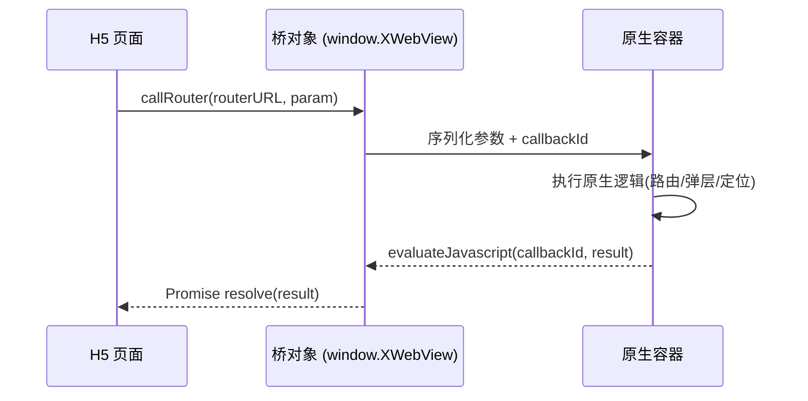
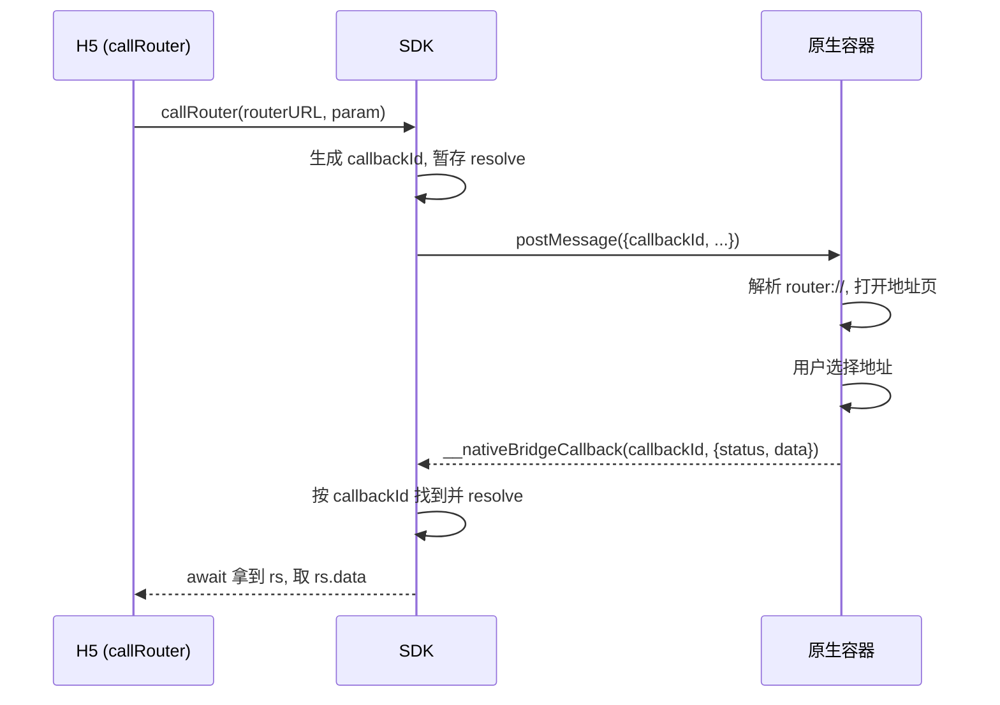
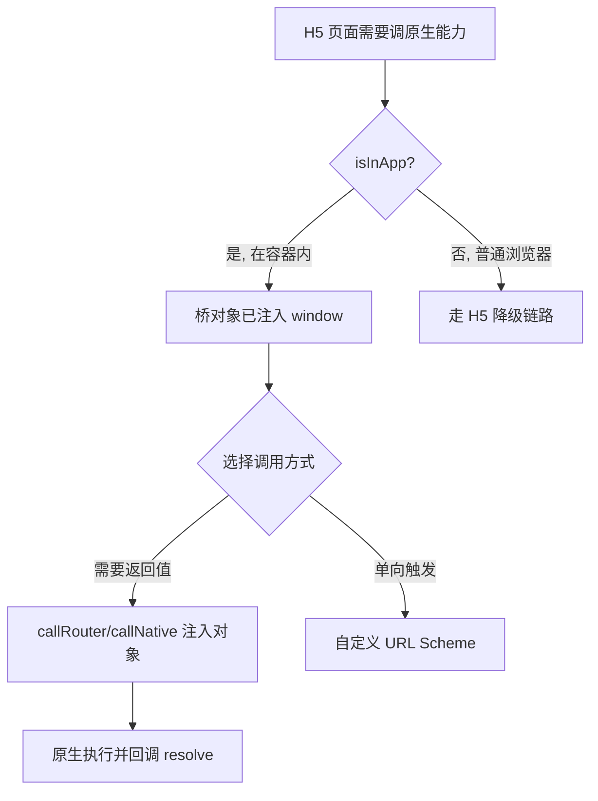

# 说清 WebView 容器与 JSBridge

同一份 React 代码，在浏览器里打开只能渲染网页，放进 App 里却能拉起原生弹层、跳转订单详情、调用定位和登录——差别不在页面本身，而在**它跑在什么"壳"里**。这篇文章拆解 App 内 H5 的运行环境：什么是 WebView 容器、JSBridge 如何在 JS 与原生之间双向传话，以及为什么同一段代码需要区分"在容器里"还是"在普通浏览器里"。

读完你能建立一个清晰的心智模型：H5 调原生，本质是**在一个被增强过的 WebView 里，通过约定好的通道发消息**。

## 从系统 WebView 到"容器"

先分清两个容易混淆的东西:**系统 WebView** 和**容器**。

系统 WebView 是操作系统提供的网页渲染内核——Android 上是 `WebView`，iOS 上是 `WKWebView`。它能做的事很纯粹:把一个网页渲染出来。它**不能**调起定位、不能弹原生对话框、不认识"登录态"这些 App 才有的概念。

而我们在 Hybrid 开发里常说的"容器",是 App 把系统 WebView **包了一层**之后的产物。这一层壳负责的事情多得多:

```
系统 WebView 内核 (Android WebView / iOS WKWebView)
        ↓ 被包装
容器 (Container)  ← 我们说的"容器"
   · 生命周期管理(创建/销毁 webview、导航)
   · 注入 JSBridge(把桥对象挂到 window)
   · 统一原生能力(路由/定位/登录/关闭等插件)
   · 离线包/缓存/预加载、埋点、白屏监控
        ↓ 承载
你的 H5 页面 (本项目 React 应用)
```

这个壳在行业里有很多名字:**Hybrid 容器**、**WebView 容器**,有的团队会给它起个专属代号(比如 `XWebView` 这类桥对象名)。叫法不重要,关键是理解它的职责:**在纯渲染能力之上,叠加"调 App 原生能力"和"工程化基建"两件事**。

页面加载时,容器会往 `window` 上注入一个桥对象(下文统称 `XWebView`),H5 就是通过它调用 `callNative`、`callRouter` 去驱动原生插件——比如弹一个原生对话框、关闭当前页。同一个容器也顺带承载了 JSSDK 的路由、定位等能力。

一句话总结:**纯系统 WebView 只会渲染网页;把它封装成容器后,才能统一注入桥、管理生命周期、提供离线与监控能力。`XWebView` 就是容器暴露给 H5 的入口对象。**

## JS 与原生如何互相"喊话"

容器搭好后,H5 和原生之间就有了一条通信管道,这条管道就是 **JSBridge**。它是双向的:JS 能触发原生逻辑,原生也能把结果回调给 JS。我们分两个方向看。

下图先给出整体的调用闭环:



### 方向一:JS 触发原生

JS 调起原生主要有两种触发方式。

**方式 1:自定义 URL Scheme 拦截。** JS 把跳转地址设成一个特殊协议(不是 http/https),容器的 WebView 拦截到这类协议后,**不发起网络请求**,而是解析其中的参数去执行原生逻辑。

```ts
// 打开客服:用自定义 scheme 携带参数
window.location.href = 'openapp.myapp://virtual?params=' + encodeURIComponent(JSON.stringify(params));

// 打开订单详情:同样是 virtual 协议
window.location.href = 'openApp.myApp://virtual?params=...';
```

关键点在于:`http://` 会真的去请求服务器,而 `openapp.xxx://` 这种自定义协议只是给原生看的**信号**,WebView 拦截后就地处理,不走网络。它简单直接,但缺点也明显——**是"发出去就不管了"的单向调用,拿不到原生的执行结果**。

**方式 2:注入全局对象(SDK 封装)。** 这是更现代、更主流的方式。容器在底层封装了平台原语——iOS 的 `WKScriptMessageHandler`、Android 的 `addJavascriptInterface`——对外只暴露一个干净的方法,比如 `callRouter`:

```ts
// 通过注入的桥对象,以路由方式打开一个原生页面
const rs = await callRouter({
  useRouter: '1',
  routerURL: 'router://WebAddressModule/pushWebView',
  routerParam,
});
```

对 H5 来说,你只是调了个普通的异步函数;底层的平台差异(iOS/Android 各自的通信机制)都被 SDK 抹平了。

### 方向二:原生回调 JS

方式 2 之所以比 URL Scheme 强大,就在于它**能拿到返回值**。SDK 把每次调用都包装成一个 `Promise`,并生成一个唯一的 `callbackId`。原生处理完后,通过 `evaluateJavascript` 反向执行一段 JS,带着 `callbackId` 找到对应的那个 Promise 并 `resolve` 结果:

```ts
const rs = await callRouter({ /* ... */ });
if (rs.status === '0') {
  // status 为 '0' 表示原生执行成功,取出数据
  const data = rs.data;
  // ...用回传的数据继续 H5 逻辑
}
```

这一来一回,JS 与原生就形成了完整的**请求—响应**闭环。这也是为什么现在大家都倾向用注入对象而非 URL Scheme:**同步的意图 + 异步的结果,写起来就像调用一个普通接口。**

## 桥的底层是怎么搭起来的

上面把 `callRouter` 当成黑盒用了,现在拆开看看它内部到底做了什么。这一层的核心,是 WebView 提供的一个能力:**原生可以向 JS 环境「注入」一个全局对象,作为两端通信的通道。** iOS 和 Android 的原语不同,但思路一致。

**Android** 通过 `addJavascriptInterface` 把一个原生对象挂到 JS 全局:

```java
webView.addJavascriptInterface(new JsBridge(), "NativeBridge");
```

注入后,JS 里就能直接 `window.NativeBridge.postMessage(...)` 把消息发给原生。

**iOS** 通过 `WKScriptMessageHandler` 注册一个消息处理器:

```swift
config.userContentController.add(self, name: "NativeBridge")
```

注入后,JS 侧对应的入口是 `window.webkit.messageHandlers.NativeBridge.postMessage(...)`。

两边的 API 形态明显不同,而 SDK 的价值就在于**把这些差异封装掉**,对外只暴露一个统一的 `callRouter`。

### SDK 内部简化实现

下面是一份去掉细节、只留骨架的最小实现,足以说明整个机制:

```js
const callbacks = {}

export function callRouter(param, extra) {
  return new Promise((resolve) => {
    const callbackId = 'cb_' + Date.now() + Math.random()
    callbacks[callbackId] = resolve            // 1. 暂存回调,用 callbackId 索引
    const msg = { callbackId, ...param }
    if (isIOS) {
      window.webkit.messageHandlers.NativeBridge.postMessage(msg)   // 2. iOS 发消息
    } else {
      window.NativeBridge.postMessage(JSON.stringify(msg))         // 2. Android 发消息
    }
  })
}

// 3. 原生处理完,反向调用这个挂在 window 上的全局函数
window.__nativeBridgeCallback = (callbackId, result) => {
  callbacks[callbackId]?.(result)              // 4. 按 id 找到并 resolve 对应 Promise
  delete callbacks[callbackId]                 //    用完即删,避免内存泄漏
}
```

关键就在这几行:**`callbackId` 是把"一次异步调用"和"它的结果"重新缝合起来的线索。** 发出去时用它当 key 存下 `resolve`;原生回来时带着同一个 id,SDK 就能精准找到那个还在 pending 的 Promise 并唤醒它。同一时刻并发多个调用也不会串味,因为每个都有自己独立的 id。

### 一次完整调用的执行流程

把打开地址管理页这个真实场景串起来,整条链路是这样走的:

1. JS 调 `callRouter`,传入 `routerURL`/`routerParam`;SDK 生成 `callbackId` 并把 `resolve` 暂存起来。
2. SDK 通过注入对象 `postMessage`,把带着 `callbackId` 的消息发给原生。
3. 原生解析 `router://...`,打开地址管理页,等用户选完地址。
4. 原生用 `evaluateJavascript` 反向调用 `window.__nativeBridgeCallback(callbackId, { status: '0', data })`。
5. SDK 按 `callbackId` 找到并 `resolve`;`await` 处拿到 `rs`,判断 `rs.status === '0'` 后取出 `rs.data`。



看懂这条链路,你就会发现所谓 JSBridge 并不神秘:**它就是"注入一个全局对象当信箱 + 用 callbackId 做请求追踪"的一套约定。**

## 一段代码,两种运行环境

理解了容器和桥,还剩最后一个实际问题:**同一份 H5 代码,可能在 App 容器里跑,也可能在微信、Safari 这类普通浏览器里被打开。** 普通浏览器里根本没有 `window.XWebView`,你贸然调 `callNative` 只会报错。

所以调原生前必须先探测环境:

```ts
if (isInApp()) {
  // 运行在 App 的 H5 容器中,桥可用,走原生能力
  await callRouter({ /* ... */ });
} else {
  // 普通浏览器,走 H5 降级链路(比如用网页版流程兜底)
  fallbackToWebFlow();
}
```

判断逻辑通常是检测桥对象是否存在或匹配特定 UA。这一步是 Hybrid 开发的纪律:**能力探测,而非假设环境**。少了它,你的页面在浏览器里就是一堆报错。

下面这张图把整条决策链串起来:



## 小结

- **容器 = 系统 WebView + 增强层**。系统内核只负责渲染;容器在其上叠加了桥注入、生命周期管理、原生能力封装和离线/监控基建。
- **桥对象是入口**。容器在页面加载时把 `XWebView` 之类的对象挂到 `window`,H5 通过它的 `callNative`/`callRouter` 驱动原生。
- **JS 调原生有两条路**。自定义 URL Scheme 拦截,简单但单向、拿不到结果;注入全局对象(SDK 封装),能通过 Promise + callbackId 拿到原生回调,是首选。
- **原生回调靠 callbackId 对号入座**。每次调用生成唯一 id,原生用 `evaluateJavascript` 带着 id 回来 resolve 对应 Promise,形成请求—响应闭环。
- **底层是"注入全局对象"**。Android 用 `addJavascriptInterface`、iOS 用 `WKScriptMessageHandler` 各自往 JS 环境挂一个通信入口,SDK 把两端差异封装成统一的 `callRouter`。
- **调用前先做能力探测**。用 `isInApp()` 这类判断区分"容器内"和"普通浏览器",容器内走桥,浏览器走降级链路——这是不能省的一步。

理解了这套模型,再看任何 Hybrid App 的 H5 就都是一个样子:**一个被增强过的 WebView,一条约定好的消息通道,以及两端各自的降级预案。**