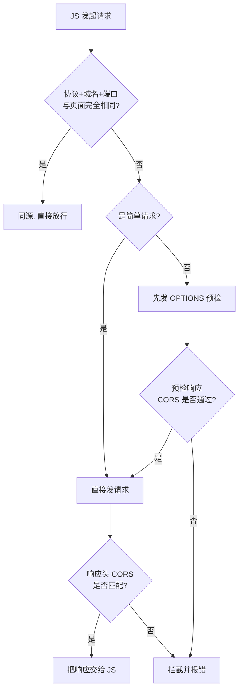
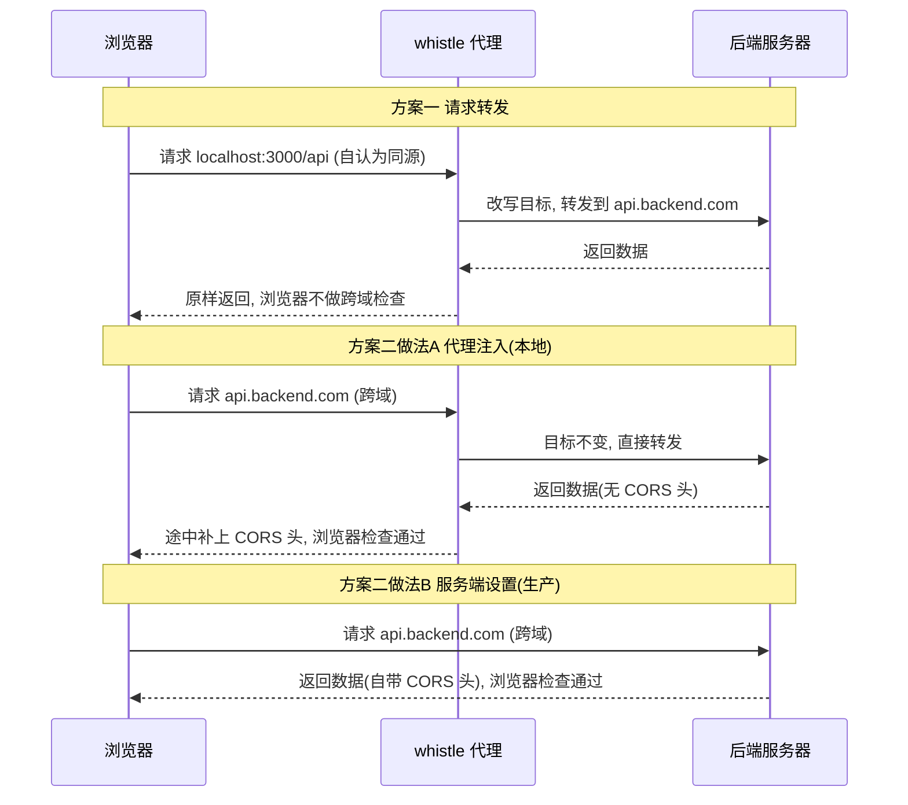

# 跨域&CORS

本地开发时，前端页面跑在 `localhost:3000`，接口部署在 `api.backend.com`，浏览器控制台立刻飘红：`No 'Access-Control-Allow-Origin' header is present`。 通常这有两种解法——**请求转发**和**设置CORS 响应头**。它们看起来都能让红字消失，但底层逻辑完全相反：一个是让浏览器**根本不知道自己在跨域**，另一个是**承认跨域、再补上一张许可证**。这篇文章讲清这两条路的分岔点，以及各自适合什么场景。

在往下看之前，先记住一个容易被忽略的前提：**跨域是浏览器的行为，不是服务器的行为**。服务器永远会正常返回数据，是浏览器根据"同源策略"决定要不要把这个响应交给页面里的 JS。
## 跨域到底是谁在拦

很多人第一次遇到跨域，会以为是"服务器拒绝了我的请求"。其实不是——请求发出去了，服务器也老老实实返回了数据，是**浏览器在拿到响应后，自己把它扣下了**。

浏览器判断是否跨域，只看三个要素：**协议（protocol）+ 域名（host）+ 端口（port）**。三者任一不同，就算跨域。

```javascript
页面地址:  http://localhost:3000
接口地址:  http://api.backend.com/user   // host 不同 → 跨域

页面地址:  https://a.com
接口地址:  http://a.com/api               // 协议不同（https vs http）→ 跨域

页面地址:  http://a.com:3000
接口地址:  http://a.com:8080/api          // 端口不同 → 跨域
```

判定为跨域后，浏览器的处理分两种情况：

- **简单请求**（如 GET、表单式 POST）：请求照发、响应照收，但浏览器**在把响应交给 JS 之前**检查响应头里的 `Access-Control-Allow-Origin`，不匹配就拦截并抛错。注意：请求其实已经打到后端了，数据也回来了，只是你在 JS 里拿不到。
- **非简单请求**（带自定义请求头、或方法是 PUT/DELETE 等）：浏览器会先自动发一个 `OPTIONS` **预检请求**，问服务器"我这么请求你允许吗"，预检通过后才发真正的请求。

下图是浏览器面对一个跨域请求时的判断路径：




## 两种处理方案

## 方案一：请求转发，让浏览器以为没跨域

第一种思路很直接：**不让浏览器知道自己在跨域**。

前端代码把接口地址写成一个**同源地址**（比如 `/api/user`），whistle 在代理层偷偷把这个请求转发到真实后端。浏览器全程认为自己请求的就是 `localhost:3000`，与页面同源，于是上面那张流程图**直接走左边的"同源，直接放行"**——跨域检查压根没被启动。

whistle 规则：

```
localhost:3000/api  http://api.backend.com/api
```

这行规则的意思是：凡是发给 `localhost:3000/api` 的请求，实际转发到 `http://api.backend.com/api`。前端代码里这么写：

```javascript
// 前端把接口写成同源相对路径, 不写真实域名
fetch('/api/user')   // 浏览器看到的是 localhost:3000/api/user, 同源
  .then(res => res.json())
```

它的几个关键点：

- **浏览器视角**：从头到尾请求的都是 `localhost:3000`，与页面同源，**不触发同源策略**。
- **地址替换发生在代理层**，浏览器完全不知情。
- 后端**不需要任何 CORS 头**，因为跨域检查根本没被启动。
- 由于不涉及跨域，自然**没有 OPTIONS 预检**这回事。

一句话概括：**把"跨域请求"伪装成"同源请求"，从源头绕开检查。**

这本质上和生产环境用 Nginx 做反向代理是同一套逻辑——你在生产里大概率也会把 `/api` 反代到后端，所以本地这么配，环境更贴近线上。

## 方案二：设置 CORS 响应头，补一张通行证

第二种思路正相反：**承认这就是跨域请求，但给响应补上浏览器想要的那张"许可证"**（`Access-Control-Allow-Origin` 等头）。浏览器看到许可，就放行。

这张"许可证"由谁来贴，又分成两种做法：**本地开发时用 whistle 代理在途中拦截注入**，**生产环境则由服务端自己在响应里设置**。两者贴的是同一批头，区别只在"谁贴、在哪贴"。

### 做法 A：whistle 代理拦截注入（本地开发）

本地开发后端往往还没开 CORS，让 whistle 在响应返回途中拦下来、补上 CORS 头，是最快的临时方案。

whistle 规则：

```
api.backend.com  resHeaders://{cors}
```

`resHeaders://` 表示修改响应头，`{cors}` 引用 whistle 的 Values 里名为 `cors` 的一段配置：

```json
{
  "Access-Control-Allow-Origin": "http://localhost:3000",
  "Access-Control-Allow-Methods": "GET,POST,PUT,DELETE,OPTIONS",
  "Access-Control-Allow-Headers": "Content-Type,Authorization"
}
```

关键点：

- **浏览器视角**：请求的确实是 `api.backend.com`，**跨域检查照常启动**，走的是上面流程图的右侧分支。
- whistle 不改地址，只在**响应返回途中**修改 HTTP 响应头，补上 CORS 许可。
- 后端代码**一行都不用动**——这也是它在本地调试时最方便的地方。

### 做法 B：服务端直接设置 CORS（生产环境）

whistle 只在你本机的代理里生效，别人访问不到。真正上线时，这张许可证必须由**服务端自己在响应里设置**——这才是 CORS 的"正规解法"。

以 Node.js/Express 为例：

```javascript
app.use((req, res, next) => {
  res.header('Access-Control-Allow-Origin', 'http://localhost:3000')
  res.header('Access-Control-Allow-Methods', 'GET,POST,PUT,DELETE,OPTIONS')
  res.header('Access-Control-Allow-Headers', 'Content-Type,Authorization')
  // 预检请求直接返回 204, 不进入业务逻辑
  if (req.method === 'OPTIONS') return res.sendStatus(204)
  next()
})
```

用了 Nginx 的话，也可以在 server/location 块里加 `add_header`，效果一样。

关键点：

- 贴的头和做法 A 完全一致，只是**发出方从代理换成了源服务器**。
- 生产环境唯一可靠的做法——不依赖任何本地代理，所有用户都能生效。

### 两种做法都要注意的坑

- **别忘了 OPTIONS 预检**：非简单请求会先发 OPTIONS，无论 whistle 还是服务端，都要保证预检响应带上正确的 CORS 头，并让它返回 204 状态、不进入业务逻辑。
- **带 Cookie 的场景有坑**：如果请求携带 Cookie（`credentials`），`Access-Control-Allow-Origin` **不能用 `*`**，必须写成具体的源，且要额外配 `Access-Control-Allow-Credentials: true`。

一句话概括：**不隐瞒跨域事实，而是让服务器（或代替它的代理）出示"我已授权"的证据，让浏览器放行。**

下面这张时序图对比三条路径里 CORS 头分别在什么位置补上：



## 两种方案怎么选

|维度|方案一（请求转发）|方案二（设置 CORS 头）|
|---|---|---|
|**原理**|改写请求目标，伪装成同源|保留跨域，补充 CORS 许可头|
|**浏览器是否触发跨域检查**|否（认为同源）|是（照常检查，靠头放行）|
|**修改位置**|请求发出前改**目标地址**|响应返回时改**响应头**|
|**由谁贴 CORS 头**|不需要|代理拦截注入（本地）/ 服务端设置（生产）|
|**是否有 OPTIONS 预检**|无|有（需一并处理）|
|**前端代码**|需写成同源地址（如 `/api`）|无需改，保持真实地址|
|**接近生产的方式**|类似 Nginx 反向代理|生产由服务端开 CORS|
|**推荐度**|更彻底、更贴近生产|适合不想改前端地址的场景|

核心区别浓缩成一句话：

- **方案一** = "换个地址，让浏览器以为没跨域"——绕过检查。
- **方案二** = "跨域就跨域，但给你看服务器的许可条"——通过检查。

## 小结

- 跨域是**浏览器同源策略**（协议 + 域名 + 端口任一不同）的行为，服务器始终正常返回数据，是浏览器决定要不要把响应交给 JS。
- **方案一（请求转发）**：把接口写成同源地址，whistle 在代理层改写目标转发到真实后端，浏览器全程认为同源，不启动跨域检查，也没有 OPTIONS 预检。更彻底、更贴近生产。
- **方案二（设置 CORS 头）**：保留真实跨域请求，给响应补上 CORS 头让浏览器放行。本地开发用 whistle 代理拦截注入（后端零改动），生产环境则由服务端自己设置。两者都要处理 OPTIONS 预检，且带 Cookie 时 `Allow-Origin` 不能用 `*`。
- 实践建议：本地开发**优先用方案一**——既省去处理预检和 Cookie 的琐碎，又和生产的反向代理逻辑一致；只有在不方便改前端接口地址时，再选方案二。
- 其实配置 hosts、用 `vite.server.proxy` 等做法，本质都逃不开这两条路：要么**伪装同域并转发**，要么**补上跨域许可**。理解了这一层，换任何工具都是同一套心智模型。